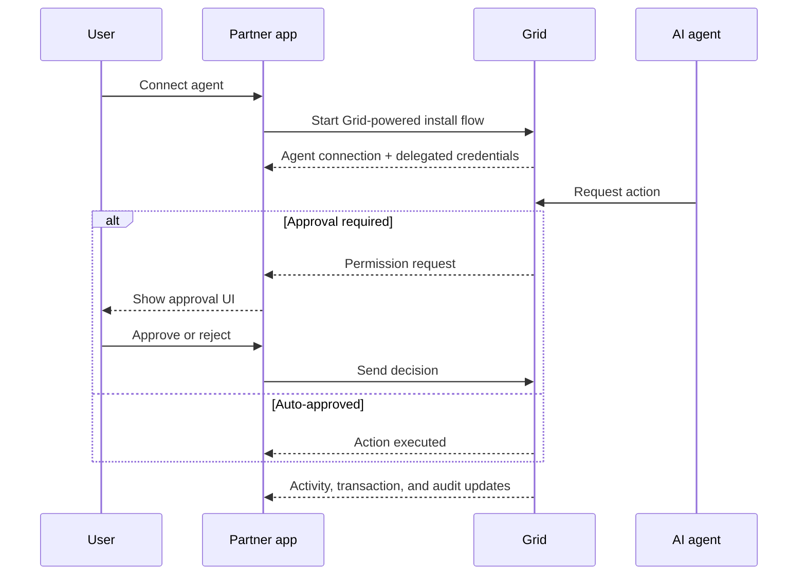

import { FeatureCard, FeatureCardGrid } from '/snippets/feature-card.mdx';

<Note>
This section describes experimental Grid functionality. Details may evolve as the agent product surface expands.
</Note>

Use Grid-managed agent connectivity to let your users connect AI agents to Global Accounts. Grid powers install, delegated credentials, policy evaluation, approval state, and execution boundaries for agent-initiated actions, while your product surfaces the connection, approval, and history experience to the end user.

## How it works

In this model:

- The customer still owns the Global Account and remains the ultimate authority over outbound movement.
- You let users connect one or more AI agents to their Grid-backed account experience.
- Grid powers agent install and delegated credentials for the connected agent.
- Grid manages the agent's allowed capabilities, evaluation rules, and approval requirements.
- The agent can propose or execute only the actions Grid allows for that customer and account scope.
- Your surfaces remain the place where users view connection status, review permission requests, and inspect agent history.

## System flow

## Design principles

<FeatureCardGrid cols={2}>
  <FeatureCard icon="/images/icons/shield.svg" title="Customer-owned funds">
    Delegation does not transfer account ownership. The customer can still require approvals, pause access, or revoke the agent entirely.
  </FeatureCard>
  <FeatureCard icon="/images/icons/IconSquareChecklistMagnifyingGlass.svg" title="Grid-managed policy">
    Permissions, spend limits, account restrictions, and approval thresholds are evaluated by Grid before any agent-initiated action executes.
  </FeatureCard>
  <FeatureCard icon="/images/icons/agent.svg" title="Bounded execution">
    Agents operate with a narrow, explicit capability set such as viewing balances, preparing withdrawals, or initiating transfers under Grid-defined controls.
  </FeatureCard>
  <FeatureCard icon="/images/icons/bell.svg" title="Auditable activity">
    Every agent-initiated action stays traceable through Grid policy decisions, approval state, and final settlement outcomes.
  </FeatureCard>
</FeatureCardGrid>

## Typical flow

1. Your platform creates or links a Global Account for the customer.
2. The customer connects an agent through a Grid-powered install flow embedded in your product.
3. Grid creates the agent connection, provisions delegated credentials, and saves the configured policy.
4. The agent requests an action such as creating a quote, creating an external account, or executing a withdrawal.
5. Grid applies the saved policy for that connection.
6. The request is either denied, executed automatically, or delivered to your product as a permission request.
7. Your user reviews the request in a trusted surface you control.
8. Grid then sends the resulting activity, transaction, and settlement updates back to your product.

## Where Global Accounts fits

This functionality is a natural extension of Global Accounts because outbound money movement already assumes customer-level authorization. Agent access adds a delegated actor while preserving the user's ownership and approval model.

## What you surface

Your product should surface:

- Agent connection state and metadata
- Policy configuration and permissions screens
- Approval and decision UX presented to end users on demand
- Agent activity, audit records, and transaction history
- Consumption of Grid events, webhooks, or approval callbacks
- Customer messaging and notification design

## Next steps

<CardGroup cols={2}>
  <Card title="Policies & permissions" href="/global-accounts/agents/policies-and-permissions" icon="shield-check">
    Define what a connected agent can do, which accounts it can access, and when Grid requires approval.
  </Card>
  <Card title="Approvals & audit" href="/global-accounts/agents/approvals-and-audit" icon="receipt">
    Design the approval and history experience your users see in your app or dashboard.
  </Card>
</CardGroup>
