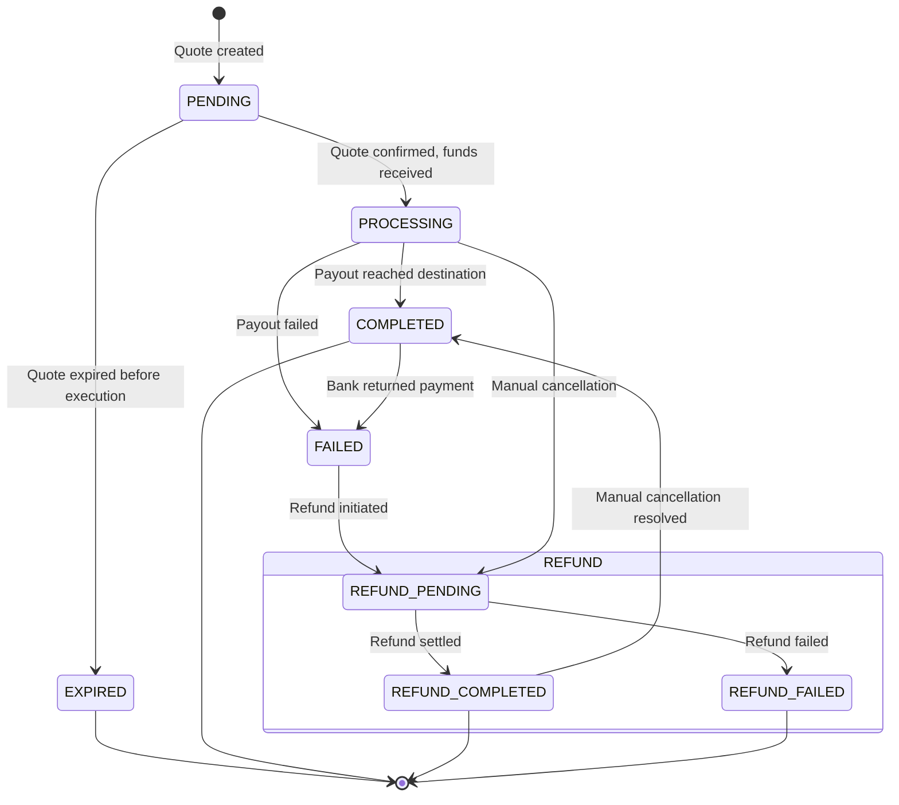

Understanding the transaction lifecycle helps you build robust payment flows, handle edge cases, and provide accurate status updates to your customers.

## Outgoing Transaction Flow

**Your customer/platform sends funds to an external recipient.**

<Steps>
  <Step title="Create Quote">
    Lock in exchange rate and fees:

    ```bash
    POST /quotes

    {
      "source": {"sourceType": "ACCOUNT", "accountId": "InternalAccount:e85dcbd6-dced-4ec4-b756-3c3a9ea3d965"},
      "destination": {"destinationType": "ACCOUNT", "accountId": "ExternalAccount:a12dcbd6-dced-4ec4-b756-3c3a9ea3d123"},
      "lockedCurrencySide": "SENDING",
      "lockedCurrencyAmount": 100000
    }
    ```

    **Response:**
    - Quote ID
    - Locked exchange rate
    - Expiration time (typically ~5 minutes or greater, depending on corridor)
  </Step>

  <Step title="Execute Quote">
    Initiate the payment:

    ```bash
    POST /quotes/{quoteId}/execute
    ```

    **Result:**
    - Transaction created with status `PENDING`
    - Source account debited immediately
    - `OUTGOING_PAYMENT.PENDING` webhook sent
  </Step>

  <Step title="Processing">
    Grid handles:
    - Currency conversion (if applicable)
    - Routing to appropriate payment rail
    - Settlement with destination bank/wallet

    **Status**: `PROCESSING`
  </Step>

  <Step title="Completion or Failure">
    **Success Path:**
    - Funds delivered to recipient
    - Status: `COMPLETED`
    - `settledAt` timestamp populated
    - `OUTGOING_PAYMENT.COMPLETED` webhook sent

    **Failure Path:**
    - Delivery failed (invalid account, etc.)
    - Status: `FAILED`
    - `failureReason` populated
    - `OUTGOING_PAYMENT.FAILED` webhook sent
    - Refund initiated automatically — track via the `refund` object and `OUTGOING_PAYMENT.REFUND_*` webhooks
  </Step>
</Steps>

Most transactions on Grid are completed in seconds.

## Same-Currency Transfers

For same-currency transfers without quotes:

### Transfer-Out (Internal → External)

```bash
POST /transfer-out

{
  "source": {"accountId": "InternalAccount:e85dcbd6-dced-4ec4-b756-3c3a9ea3d965"},
  "destination": {"accountId": "ExternalAccount:a12dcbd6-dced-4ec4-b756-3c3a9ea3d123", "currency": "USD"},
  "amount": 100000
}
```

**Response:**

```json
{
  "id": "Transaction:...",
  "status": "PENDING",
  "type": "OUTGOING"
}
```

Follows same lifecycle as quote-based outgoing transactions.

### Transfer-In (External → Internal)

```bash
POST /transfer-in

{
  "source": {"accountId": "ExternalAccount:a12dcbd6-dced-4ec4-b756-3c3a9ea3d123", "currency": "USD"},
  "destination": {"accountId": "InternalAccount:e85dcbd6-dced-4ec4-b756-3c3a9ea3d965"},
  "amount": 100000
}
```

Only works for "pullable" external accounts (e.g., debit cards).

## Outgoing Payment Status

A single `status` field represents whether the transaction reached its destination:

| Status | Description |
|--------|-------------|
| **PENDING** | Quote is pending confirmation |
| **EXPIRED** | Quote wasn't executed before the expiry window |
| **PROCESSING** | Executing the quote after receiving funds (checking internal balances, or push/pull to/from external account) |
| **COMPLETED** | Payout successfully reached the destination account |
| **FAILED** | Something went wrong — accompanied by a `failureReason` |

<Warning>
`EXPIRED` and `FAILED` are terminal states, but `COMPLETED` is not always final — a bank can return a payment after it was marked `COMPLETED`, moving it to `FAILED`. Always continue processing webhook events for transactions even after they reach `COMPLETED`.
</Warning>

### State Diagram



## Refund Object

When a payment fails or is cancelled, refunds are tracked in a dedicated object on the transaction, decoupled from the payment status:

| Field | Description |
|-------|-------------|
| `reference` | Refund reference ID |
| `initiatedAt` | Timestamp when refund was initiated |
| `settledAt` | Timestamp when refund settled |
| `status` | `PENDING`, `COMPLETED`, or `FAILED` |
| `reason` | Why the refund occurred — `TRANSACTION_FAILED`, `USER_CANCELLATION`, or `TIMEOUT` |

```json
{
  "id": "Transaction:019542f5-b3e7-1d02-0000-000000000030",
  "status": "FAILED",
  "type": "OUTGOING",
  "failureReason": "QUOTE_EXECUTION_FAILED",
  "refund": {
    "reference": "UMA-Q12345-REFUND",
    "initiatedAt": "2025-10-03T15:10:00Z",
    "settledAt": "2025-10-03T15:15:00Z",
    "status": "COMPLETED",
    "reason": "TRANSACTION_FAILED"
  }
}
```

## Webhooks

Outgoing payment webhooks use the format `OUTGOING_PAYMENT.<STATUS>`. The webhook request body contains the full transaction resource.

### Event Types

| Event | Description |
|-------|-------------|
| `OUTGOING_PAYMENT.PENDING` | Transaction created, quote pending confirmation |
| `OUTGOING_PAYMENT.PROCESSING` | Quote confirmed, payout in progress |
| `OUTGOING_PAYMENT.COMPLETED` | Payout reached destination |
| `OUTGOING_PAYMENT.FAILED` | Payout failed |
| `OUTGOING_PAYMENT.EXPIRED` | Quote expired before execution |
| `OUTGOING_PAYMENT.REFUND_PENDING` | Refund initiated |
| `OUTGOING_PAYMENT.REFUND_COMPLETED` | Refund settled |
| `OUTGOING_PAYMENT.REFUND_FAILED` | Refund failed |

### Example Payloads

<Tabs>
<Tab title="PENDING">
```json
{
  "type": "OUTGOING_PAYMENT.PENDING",
  "data": {
    "id": "Transaction:...",
    "status": "PENDING",
    "type": "OUTGOING",
    "sentAmount": {"amount": 100000, "currency": {"code": "USD"}},
    "receivedAmount": {"amount": 92000, "currency": {"code": "EUR"}},
    "createdAt": "2025-10-03T15:00:00Z"
  }
}
```
</Tab>

<Tab title="COMPLETED">
```json
{
  "type": "OUTGOING_PAYMENT.COMPLETED",
  "data": {
    "id": "Transaction:...",
    "status": "COMPLETED",
    "settledAt": "2025-10-03T15:05:00Z"
  }
}
```
</Tab>

<Tab title="FAILED">
```json
{
  "type": "OUTGOING_PAYMENT.FAILED",
  "data": {
    "id": "Transaction:...",
    "status": "FAILED",
    "failureReason": "INVALID_BANK_ACCOUNT"
  }
}
```
</Tab>

<Tab title="REFUND_COMPLETED">
```json
{
  "type": "OUTGOING_PAYMENT.REFUND_COMPLETED",
  "data": {
    "id": "Transaction:...",
    "status": "FAILED",
    "refund": {
      "reference": "UMA-Q12345-REFUND",
      "initiatedAt": "2025-10-03T15:10:00Z",
      "settledAt": "2025-10-03T15:15:00Z",
      "status": "COMPLETED",
      "reason": "TRANSACTION_FAILED"
    }
  }
}
```
</Tab>
</Tabs>

### Handling Webhooks

```javascript
app.post('/webhooks/grid', async (req, res) => {
  const { data, type } = req.body;

  switch (type) {
    case 'OUTGOING_PAYMENT.COMPLETED':
      await notifyCustomer(data.customerId, 'Payment delivered!');
      break;

    case 'OUTGOING_PAYMENT.FAILED':
      await notifyCustomer(data.customerId, `Payment failed: ${data.failureReason}`);
      break;

    case 'OUTGOING_PAYMENT.REFUND_COMPLETED':
      await notifyCustomer(data.customerId, 'Refund completed.');
      break;

    case 'OUTGOING_PAYMENT.REFUND_FAILED':
      await notifyCustomer(data.customerId, 'Refund failed. Contact support.');
      break;
  }

  await updateTransactionStatus(data.id, type);
  res.status(200).json({ received: true });
});
```

### Scenarios

<Tabs>
<Tab title="Happy Path">
The standard successful payment flow:

1. `OUTGOING_PAYMENT.PENDING`
2. `OUTGOING_PAYMENT.PROCESSING`
3. `OUTGOING_PAYMENT.COMPLETED`
</Tab>

<Tab title="Failure with Refund">
Payment fails and the refund succeeds:

1. `OUTGOING_PAYMENT.PENDING`
2. `OUTGOING_PAYMENT.PROCESSING`
3. `OUTGOING_PAYMENT.FAILED`
4. `OUTGOING_PAYMENT.REFUND_PENDING`
5. `OUTGOING_PAYMENT.REFUND_COMPLETED`
</Tab>

<Tab title="Failure with Failed Refund">
Payment fails and the refund also fails:

1. `OUTGOING_PAYMENT.PENDING`
2. `OUTGOING_PAYMENT.PROCESSING`
3. `OUTGOING_PAYMENT.FAILED`
4. `OUTGOING_PAYMENT.REFUND_PENDING`
5. `OUTGOING_PAYMENT.REFUND_FAILED`

<Warning>
If a refund fails, contact support to resolve the issue manually.
</Warning>
</Tab>

<Tab title="Bank Return">
Payment initially succeeds but the bank returns it:

1. `OUTGOING_PAYMENT.PENDING`
2. `OUTGOING_PAYMENT.PROCESSING`
3. `OUTGOING_PAYMENT.COMPLETED`
4. `OUTGOING_PAYMENT.FAILED`
5. `OUTGOING_PAYMENT.REFUND_PENDING`
6. `OUTGOING_PAYMENT.REFUND_COMPLETED`

<Info>
Bank returns can happen days after initial completion. Continue processing webhook events for transactions even after they reach `COMPLETED`.
</Info>
</Tab>

<Tab title="Manual Cancellation">
Payment is cancelled while still processing, and the refund succeeds:

1. `OUTGOING_PAYMENT.PENDING`
2. `OUTGOING_PAYMENT.PROCESSING`
3. `OUTGOING_PAYMENT.REFUND_PENDING`
4. `OUTGOING_PAYMENT.REFUND_COMPLETED`
5. `OUTGOING_PAYMENT.COMPLETED`

<Info>
In the manual cancellation flow, `OUTGOING_PAYMENT.COMPLETED` fires after the refund settles. This indicates the payout provider ultimately delivered the original payment despite the cancellation attempt. Your system should check the transaction's `refund` object to determine whether the payment was refunded or delivered.
</Info>
</Tab>
</Tabs>

## Listing Transactions

Query all transactions for a customer or date range:

```bash
GET /transactions?customerId=Customer:abc123&startDate=2025-10-01T00:00:00Z&limit=50
```

**Response:**

```json
{
  "data": [
    {
      "id": "Transaction:...",
      "status": "COMPLETED",
      "type": "OUTGOING",
      "sentAmount": {"amount": 100000, "currency": {"code": "USD"}},
      "receivedAmount": {"amount": 92000, "currency": {"code": "EUR"}},
      "settledAt": "2025-10-03T15:05:00Z"
    }
  ],
  "hasMore": false,
  "nextCursor": null
}
```

Use for reconciliation and reporting.

## Failure Handling

### Common Failure Reasons

| Failure Reason | Description | Recovery |
|----------------|-------------|----------|
| `QUOTE_EXPIRED` | Quote expired before execution | Create new quote |
| `QUOTE_EXECUTION_FAILED` | Error executing the quote | Create new quote |
| `INSUFFICIENT_BALANCE` | Source account lacks funds | Fund account, retry |
| `LIGHTNING_PAYMENT_FAILED` | Lightning network payment could not be routed | Retry or use alternative rail |
| `FUNDING_AMOUNT_MISMATCH` | Funding amount doesn't match expected amount | Verify amounts and retry |
| `COUNTERPARTY_POST_TX_FAILED` | Post-transaction processing at counterparty failed | Contact support |

When a transaction fails, a refund is initiated automatically. Track the refund via the `refund` object on the transaction and `OUTGOING_PAYMENT.REFUND_*` webhook events. See [Refund Object](#refund-object) above.

## Best Practices

<AccordionGroup>
  <Accordion title="Store transaction IDs for reconciliation">
    Save transaction IDs to your database:

    ```javascript
    const transaction = await executeQuote(quoteId);
    await db.transactions.insert({
      gridTransactionId: transaction.id,
      internalPaymentId: paymentId,
      status: transaction.status,
      createdAt: new Date()
    });
    ```
  </Accordion>

  <Accordion title="Handle idempotency">
    Use idempotency keys for safe retries:

    ```javascript
    const idempotencyKey = `payment-${userId}-${Date.now()}`;
    await createQuote({...params, idempotencyKey});
    ```
  </Accordion>

  <Accordion title="Provide clear status messages to users">
    Translate technical statuses to user-friendly messages:

    ```javascript
    function getUserMessage(webhookType, data) {
      switch (webhookType) {
        case 'OUTGOING_PAYMENT.PENDING':
          return 'Payment processing...';
        case 'OUTGOING_PAYMENT.PROCESSING':
          return 'Payment in progress...';
        case 'OUTGOING_PAYMENT.COMPLETED':
          return 'Payment delivered!';
        case 'OUTGOING_PAYMENT.FAILED':
          return 'Payment failed. Please try again or contact support.';
        case 'OUTGOING_PAYMENT.REFUND_PENDING':
          return 'Refund in progress...';
        case 'OUTGOING_PAYMENT.REFUND_COMPLETED':
          return 'Refund completed. Funds returned to your account.';
        case 'OUTGOING_PAYMENT.REFUND_FAILED':
          return 'Refund failed. Please contact support.';
        default:
          return 'Payment status updated.';
      }
    }
    ```
  </Accordion>
</AccordionGroup>
