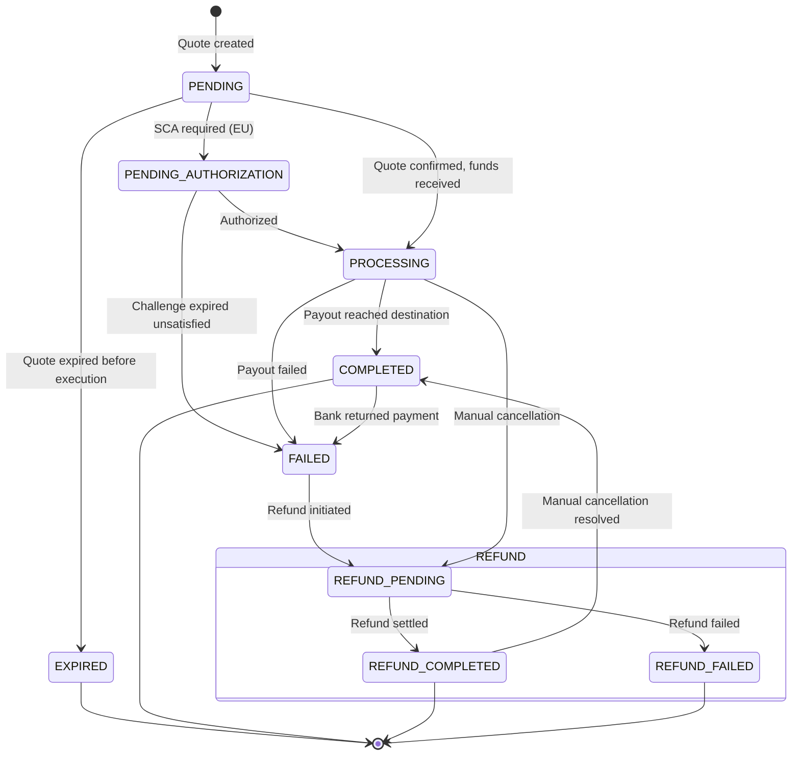

Understanding the transaction lifecycle helps you build robust payment flows, handle edge cases, and provide accurate status updates to your customers.

## Incoming or outgoing

Every transfer creates a transaction, and its `type` is keyed on the **destination** —
where the money came from makes no difference:

| Destination | `type` | Webhook family |
|---|---|---|
| Internal account | `INCOMING` | `INCOMING_PAYMENT.<STATUS>` |
| External account | `OUTGOING` | `OUTGOING_PAYMENT.<STATUS>` |
| UMA address | `OUTGOING` | `OUTGOING_PAYMENT.<STATUS>` |

In practice:

- A payout from an internal account to an external account is `OUTGOING`.
- A pull from an external account into an internal account is `INCOMING`, even though you
  initiated it.
- A transfer between two internal accounts is `INCOMING`.
- A deposit that lands by paying an internal account's
  [payment instructions](/payouts-and-b2b/depositing-funds/internal-accounts) is `INCOMING`,
  as is a payment received at one of your customers' UMA addresses.

The type decides which lifecycle below applies and which webhooks you receive, so branch on
it rather than on which endpoint you called.

<Info>
  Card spending produces a third type, `CARD`, which follows its own lifecycle.
</Info>

## Outgoing Transaction Flow

**Your customer/platform sends funds to an external recipient.**

<Steps>
  <Step title="Create Quote">
    Lock in exchange rate and fees:

    ```bash
    POST /quotes

    {
      "source": {"sourceType": "ACCOUNT", "accountId": "InternalAccount:e85dcbd6-dced-4ec4-b756-3c3a9ea3d965"},
      "destination": {"destinationType": "ACCOUNT", "accountId": "ExternalAccount:a12dcbd6-dced-4ec4-b756-3c3a9ea3d123"},
      "lockedCurrencySide": "SENDING",
      "lockedCurrencyAmount": 100000
    }
    ```

    **Response:**
    - Quote ID
    - Locked exchange rate
    - Expiration time (typically ~5 minutes or greater, depending on corridor)
  </Step>

  <Step title="Execute Quote">
    Initiate the payment:

    ```bash
    POST /quotes/{quoteId}/execute
    ```

    **Result:**
    - Transaction created with status `PENDING`
    - Source account debited immediately
    - `OUTGOING_PAYMENT.PENDING` webhook sent
  </Step>

  <Step title="Processing">
    Grid handles:
    - Currency conversion (if applicable)
    - Routing to appropriate payment rail
    - Settlement with destination bank/wallet

    **Status**: `PROCESSING`
  </Step>

  <Step title="Completion or Failure">
    **Success Path:**
    - Funds delivered to recipient
    - Status: `COMPLETED`
    - `settledAt` timestamp populated
    - `OUTGOING_PAYMENT.COMPLETED` webhook sent

    **Failure Path:**
    - Delivery failed (invalid account, etc.)
    - Status: `FAILED`
    - `failureReason` populated
    - `OUTGOING_PAYMENT.FAILED` webhook sent
    - Refund initiated automatically — track via the `refund` object and `OUTGOING_PAYMENT.REFUND_*` webhooks
  </Step>
</Steps>

Most transactions on Grid are completed in seconds.

## Outgoing Payment Status

A single `status` field represents whether the transaction reached its destination:

| Status | Description |
|--------|-------------|
| **PENDING** | Quote is pending confirmation |
| **PENDING_AUTHORIZATION** | Awaiting Strong Customer Authentication. Only occurs for customers in regions where SCA is required (e.g., EU). The challenge lives on the quote, not the transaction — fetch `GET /quotes/{quoteId}` using the transaction's `quoteId`, then authorize its `scaChallenge` with `POST /quotes/{quoteId}/authorize`. |
| **EXPIRED** | Quote wasn't executed before the expiry window |
| **PROCESSING** | Executing the quote after receiving funds (checking internal balances, or push/pull to/from external account) |
| **COMPLETED** | Payout successfully reached the destination account |
| **FAILED** | Something went wrong — accompanied by a `failureReason` |

<Warning>
`EXPIRED` and `FAILED` are terminal states, but `COMPLETED` is not always final — a bank can return a payment after it was marked `COMPLETED`, moving it to `FAILED`. Always continue processing webhook events for transactions even after they reach `COMPLETED`.
</Warning>

### State Diagram


```mermaid
stateDiagram-v2
    [*] --> PENDING : Quote created
    PENDING --> PENDING_AUTHORIZATION : SCA required (EU)
    PENDING_AUTHORIZATION --> PROCESSING : Authorized
    PENDING_AUTHORIZATION --> FAILED : Challenge expired unsatisfied
    PENDING --> PROCESSING : Quote confirmed, funds received
    PENDING --> EXPIRED : Quote expired before execution
    PROCESSING --> COMPLETED : Payout reached destination
    PROCESSING --> FAILED : Payout failed
    COMPLETED --> FAILED : Bank returned payment
    FAILED --> REFUND_PENDING : Refund initiated
    PROCESSING --> REFUND_PENDING : Manual cancellation
    state "REFUND" as refund {
        REFUND_PENDING --> REFUND_COMPLETED : Refund settled
        REFUND_PENDING --> REFUND_FAILED : Refund failed
    }
    REFUND_COMPLETED --> COMPLETED : Manual cancellation resolved
    EXPIRED --> [*]
    COMPLETED --> [*]
    REFUND_COMPLETED --> [*]
    REFUND_FAILED --> [*]
```

## Refund Object

When a payment fails or is cancelled, refunds are tracked in a dedicated object on the transaction, decoupled from the payment status:

| Field | Description |
|-------|-------------|
| `reference` | Refund reference ID |
| `initiatedAt` | Timestamp when refund was initiated |
| `settledAt` | Timestamp when refund settled |
| `status` | `PENDING`, `COMPLETED`, or `FAILED` |
| `reason` | Why the refund occurred — `TRANSACTION_FAILED`, `USER_CANCELLATION`, or `TIMEOUT` |

```json
{
  "id": "Transaction:019542f5-b3e7-1d02-0000-000000000030",
  "status": "FAILED",
  "type": "OUTGOING",
  "direction": "DEBIT",
  "failureReason": "QUOTE_EXECUTION_FAILED",
  "refund": {
    "reference": "UMA-Q12345-REFUND",
    "initiatedAt": "2025-10-03T15:10:00Z",
    "settledAt": "2025-10-03T15:15:00Z",
    "status": "COMPLETED",
    "reason": "TRANSACTION_FAILED"
  }
}
```

### Refund destination

Where a refund lands depends on how the transaction was funded:

- **Prefunded (internal account)** — the amount is credited back to the source internal account balance.
- **Real-time (JIT) funding via an instant fiat rail** (RTP, PIX, SEPA Instant, etc.) — the refund is returned to the originating funding instrument.
- **Real-time (JIT) funding via crypto** (for example USDC or BTC) — the refunded amount is credited to the customer's **internal account balance for that asset**. It is **not** returned to the wallet the funds were sent from.

<Note>
  Crypto deposits are not refunded to the source wallet because Grid cannot verify that the sending wallet belongs to your customer — the funds may have originated from an exchange or another third-party address. The credited internal balance is reusable: spend it with a new quote, or withdraw it to an external wallet with a quote whose destination is that wallet.
</Note>

## Webhooks

Payment webhooks use the format `<TYPE>_PAYMENT.<STATUS>`, matching the transaction's `type`.
The webhook request body contains the full transaction resource.

### Outgoing event types

| Event | Description |
|-------|-------------|
| `OUTGOING_PAYMENT.PENDING` | Transaction created, quote pending confirmation |
| `OUTGOING_PAYMENT.PENDING_AUTHORIZATION` | Awaiting Strong Customer Authentication (EU customers only) |
| `OUTGOING_PAYMENT.PROCESSING` | Quote confirmed, payout in progress |
| `OUTGOING_PAYMENT.COMPLETED` | Payout reached destination |
| `OUTGOING_PAYMENT.FAILED` | Payout failed |
| `OUTGOING_PAYMENT.EXPIRED` | Quote expired before execution |
| `OUTGOING_PAYMENT.REFUND_PENDING` | Refund initiated |
| `OUTGOING_PAYMENT.REFUND_COMPLETED` | Refund settled |
| `OUTGOING_PAYMENT.REFUND_FAILED` | Refund failed |

### Incoming event types

| Event | Description |
|-------|-------------|
| `INCOMING_PAYMENT.PENDING` | Funds are on their way to the internal account |
| `INCOMING_PAYMENT.PROCESSING` | Funding received, credit in progress |
| `INCOMING_PAYMENT.COMPLETED` | Funds credited to the internal account |
| `INCOMING_PAYMENT.FAILED` | The deposit failed |
| `INCOMING_PAYMENT.REFUND_PENDING` | Refund initiated |
| `INCOMING_PAYMENT.REFUND_COMPLETED` | Refund settled |
| `INCOMING_PAYMENT.REFUND_FAILED` | Refund failed |

### Example Payloads

<Tabs>
<Tab title="PENDING">
```json
{
  "type": "OUTGOING_PAYMENT.PENDING",
  "data": {
    "id": "Transaction:...",
    "status": "PENDING",
    "type": "OUTGOING",
    "direction": "DEBIT",
    "sentAmount": {"amount": 100000, "currency": {"code": "USD"}},
    "receivedAmount": {"amount": 92000, "currency": {"code": "EUR"}},
    "createdAt": "2025-10-03T15:00:00Z"
  }
}
```
</Tab>

<Tab title="PENDING_AUTHORIZATION">
```json
{
  "type": "OUTGOING_PAYMENT.PENDING_AUTHORIZATION",
  "data": {
    "id": "Transaction:...",
    "status": "PENDING_AUTHORIZATION",
    "type": "OUTGOING",
    "customerId": "Customer:019542f5-b3e7-1d02-0000-000000000001",
    "quoteId": "Quote:019542f5-b3e7-1d02-0000-000000000006",
    "sentAmount": {"amount": 100000, "currency": {"code": "USD"}},
    "receivedAmount": {"amount": 92000, "currency": {"code": "EUR"}},
    "createdAt": "2025-10-03T15:00:00Z"
  }
}
```

The payload carries no `scaChallenge` — that field lives on the quote. Use `quoteId` to fetch `GET /quotes/{quoteId}`, read its `scaChallenge`, and authorize with `POST /quotes/{quoteId}/authorize`.
</Tab>

<Tab title="COMPLETED">
```json
{
  "type": "OUTGOING_PAYMENT.COMPLETED",
  "data": {
    "id": "Transaction:...",
    "status": "COMPLETED",
    "settledAt": "2025-10-03T15:05:00Z"
  }
}
```
</Tab>

<Tab title="FAILED">
```json
{
  "type": "OUTGOING_PAYMENT.FAILED",
  "data": {
    "id": "Transaction:...",
    "status": "FAILED",
    "failureReason": "ACCOUNT_INVALID"
  }
}
```
</Tab>

<Tab title="REFUND_COMPLETED">
```json
{
  "type": "OUTGOING_PAYMENT.REFUND_COMPLETED",
  "data": {
    "id": "Transaction:...",
    "status": "FAILED",
    "refund": {
      "reference": "UMA-Q12345-REFUND",
      "initiatedAt": "2025-10-03T15:10:00Z",
      "settledAt": "2025-10-03T15:15:00Z",
      "status": "COMPLETED",
      "reason": "TRANSACTION_FAILED"
    }
  }
}
```
</Tab>
</Tabs>

### Handling Webhooks

```javascript
app.post('/webhooks/grid', async (req, res) => {
  const { data, type } = req.body;

  switch (type) {
    case 'OUTGOING_PAYMENT.PENDING_AUTHORIZATION': {
      // EU customers only: the challenge is on the quote, not the transaction
      const quote = await getQuote(data.quoteId);
      await promptScaChallenge(data.customerId, data.quoteId, quote.scaChallenge);
      break;
    }

    case 'OUTGOING_PAYMENT.COMPLETED':
      await notifyCustomer(data.customerId, 'Payment delivered!');
      break;

    case 'OUTGOING_PAYMENT.FAILED':
      await notifyCustomer(data.customerId, `Payment failed: ${data.failureReason}`);
      break;

    case 'OUTGOING_PAYMENT.REFUND_COMPLETED':
      await notifyCustomer(data.customerId, 'Refund completed.');
      break;

    case 'OUTGOING_PAYMENT.REFUND_FAILED':
      await notifyCustomer(data.customerId, 'Refund failed. Contact support.');
      break;
  }

  await updateTransactionStatus(data.id, type);
  res.status(200).json({ received: true });
});
```

### Scenarios

<Tabs>
<Tab title="Happy Path">
The standard successful payment flow:

1. `OUTGOING_PAYMENT.PENDING`
2. `OUTGOING_PAYMENT.PROCESSING`
3. `OUTGOING_PAYMENT.COMPLETED`
</Tab>

<Tab title="SCA Authorization (EU)">
The customer must satisfy a Strong Customer Authentication challenge before the payout proceeds:

1. `OUTGOING_PAYMENT.PENDING`
2. `OUTGOING_PAYMENT.PENDING_AUTHORIZATION`
3. `OUTGOING_PAYMENT.PROCESSING`
4. `OUTGOING_PAYMENT.COMPLETED`

<Info>
A single payment can require more than one authorization in sequence, so `OUTGOING_PAYMENT.PENDING_AUTHORIZATION` may arrive several times before `PROCESSING`. Loop on the quote's status rather than assuming one authorization releases the payment.
</Info>

If the challenge expires before the customer satisfies it, the transaction lands on `OUTGOING_PAYMENT.FAILED` with `failureReason: SCA_NOT_COMPLETED` and no funds move. Create a new quote to try again.
</Tab>

<Tab title="Failure with Refund">
Payment fails and the refund succeeds:

1. `OUTGOING_PAYMENT.PENDING`
2. `OUTGOING_PAYMENT.PROCESSING`
3. `OUTGOING_PAYMENT.FAILED`
4. `OUTGOING_PAYMENT.REFUND_PENDING`
5. `OUTGOING_PAYMENT.REFUND_COMPLETED`
</Tab>

<Tab title="Failure with Failed Refund">
Payment fails and the refund also fails:

1. `OUTGOING_PAYMENT.PENDING`
2. `OUTGOING_PAYMENT.PROCESSING`
3. `OUTGOING_PAYMENT.FAILED`
4. `OUTGOING_PAYMENT.REFUND_PENDING`
5. `OUTGOING_PAYMENT.REFUND_FAILED`

<Warning>
If a refund fails, contact support to resolve the issue manually.
</Warning>
</Tab>

<Tab title="Bank Return">
Payment initially succeeds but the bank returns it:

1. `OUTGOING_PAYMENT.PENDING`
2. `OUTGOING_PAYMENT.PROCESSING`
3. `OUTGOING_PAYMENT.COMPLETED`
4. `OUTGOING_PAYMENT.FAILED`
5. `OUTGOING_PAYMENT.REFUND_PENDING`
6. `OUTGOING_PAYMENT.REFUND_COMPLETED`

<Info>
Bank returns can happen days after initial completion. Continue processing webhook events for transactions even after they reach `COMPLETED`.
</Info>
</Tab>

<Tab title="Manual Cancellation">
Payment is cancelled while still processing, and the refund succeeds:

1. `OUTGOING_PAYMENT.PENDING`
2. `OUTGOING_PAYMENT.PROCESSING`
3. `OUTGOING_PAYMENT.REFUND_PENDING`
4. `OUTGOING_PAYMENT.REFUND_COMPLETED`
5. `OUTGOING_PAYMENT.COMPLETED`

<Info>
In the manual cancellation flow, `OUTGOING_PAYMENT.COMPLETED` fires after the refund settles. This indicates the payout provider ultimately delivered the original payment despite the cancellation attempt. Your system should check the transaction's `refund` object to determine whether the payment was refunded or delivered.
</Info>
</Tab>
</Tabs>

## Receipt Delivery Confirmation

Some platforms are contractually required to send a receipt to their customer after a transaction completes. Use the receipt confirmation endpoint to record when the receipt was delivered:

```bash
curl -X POST https://api.lightspark.com/grid/2025-10-13/transactions/Transaction:019542f5-b3e7-1d02-0000-000000000030/confirm \
  -u "$GRID_CLIENT_ID:$GRID_CLIENT_SECRET" \
  -H "Content-Type: application/json" \
  -d '{"receiptDeliveryConfirmedAt": "2025-08-15T14:31:00Z"}'
```

**Response:** the updated transaction, with `receiptDeliveryConfirmedAt` populated:

```json
{
  "id": "Transaction:019542f5-b3e7-1d02-0000-000000000030",
  "status": "COMPLETED",
  "receiptDeliveryConfirmedAt": "2025-08-15T14:31:00Z"
}
```

If you omit `receiptDeliveryConfirmedAt` from the request body, Grid uses the current server time. Calling this endpoint again updates the stored confirmation time.

<Info>
This endpoint is only necessary if your platform agreement requires receipt confirmation. Most integrations do not need this step.
</Info>

## Listing Transactions

Query all transactions for a customer or date range:

```bash
GET /transactions?customerId=Customer:abc123&startDate=2025-10-01T00:00:00Z&limit=50
```

**Response:**

```json
{
  "data": [
    {
      "id": "Transaction:...",
      "status": "COMPLETED",
      "type": "OUTGOING",
      "direction": "DEBIT",
      "sentAmount": {"amount": 100000, "currency": {"code": "USD"}},
      "receivedAmount": {"amount": 92000, "currency": {"code": "EUR"}},
      "settledAt": "2025-10-03T15:05:00Z"
    }
  ],
  "hasMore": false,
  "nextCursor": null
}
```

Use for reconciliation and reporting.

## Failure Handling

### Common Failure Reasons

| Failure Reason | Description | Recovery |
|----------------|-------------|----------|
| `QUOTE_EXPIRED` | Quote expired before execution | Create new quote |
| `QUOTE_RATE_UNAVAILABLE` | Quoted exchange rate was refused at execution; nothing was exchanged | Create new quote |
| `QUOTE_EXECUTION_FAILED` | Error executing the quote; a debited amount is refunded automatically | Create new quote |
| `FUNDING_AMOUNT_MISMATCH` | Funding amount doesn't match expected amount | Verify amounts and retry |
| `PAYOUT_RETURNED` | Receiving bank returned or reversed the payout | Verify details and retry |
| `LIMIT_EXCEEDED` | Payout exceeds a partner limit | Reduce amount or contact support |
| `ACCOUNT_CANNOT_RECEIVE` | Recipient account can't accept the payment | Use a different account |
| `ACCOUNT_INVALID` | Recipient account details are wrong or not found | Correct recipient details |
| `COMPLIANCE_REJECTED` | Payout partner rejected on compliance grounds | Contact support |

The `failureReason` field on a transaction may return additional values, including deprecated reasons (`LIGHTNING_PAYMENT_FAILED`, `COUNTERPARTY_POST_TX_FAILED`) retained for historical transactions.

When a transaction fails, a refund is initiated automatically. Track the refund via the `refund` object on the transaction and `OUTGOING_PAYMENT.REFUND_*` webhook events. See [Refund Object](#refund-object) above.

## Best Practices

<AccordionGroup>
  <Accordion title="Store transaction IDs for reconciliation">
    Save transaction IDs to your database:

    ```javascript
    const transaction = await executeQuote(quoteId);
    await db.transactions.insert({
      gridTransactionId: transaction.id,
      internalPaymentId: paymentId,
      status: transaction.status,
      createdAt: new Date()
    });
    ```
  </Accordion>

  <Accordion title="Handle idempotency">
    Use the `Idempotency-Key` HTTP header for safe retries:

    ```javascript
    const idempotencyKey = `payment-${userId}-${Date.now()}`;
    await fetch('https://api.lightspark.com/grid/2025-10-13/quotes', {
      method: 'POST',
      headers: {
        'Idempotency-Key': idempotencyKey,
        'Content-Type': 'application/json',
        'Authorization': `Basic ${credentials}`,
      },
      body: JSON.stringify(params),
    });
    ```
  </Accordion>

  <Accordion title="Provide clear status messages to users">
    Translate technical statuses to user-friendly messages:

    ```javascript
    function getUserMessage(webhookType, data) {
      switch (webhookType) {
        case 'OUTGOING_PAYMENT.PENDING':
          return 'Payment processing...';
        case 'OUTGOING_PAYMENT.PENDING_AUTHORIZATION':
          return 'Authorization required. Complete the security challenge to continue.';
        case 'OUTGOING_PAYMENT.PROCESSING':
          return 'Payment in progress...';
        case 'OUTGOING_PAYMENT.COMPLETED':
          return 'Payment delivered!';
        case 'OUTGOING_PAYMENT.FAILED':
          return 'Payment failed. Please try again or contact support.';
        case 'OUTGOING_PAYMENT.REFUND_PENDING':
          return 'Refund in progress...';
        case 'OUTGOING_PAYMENT.REFUND_COMPLETED':
          return 'Refund completed. Funds returned to your account.';
        case 'OUTGOING_PAYMENT.REFUND_FAILED':
          return 'Refund failed. Please contact support.';
        default:
          return 'Payment status updated.';
      }
    }
    ```
  </Accordion>
</AccordionGroup>
