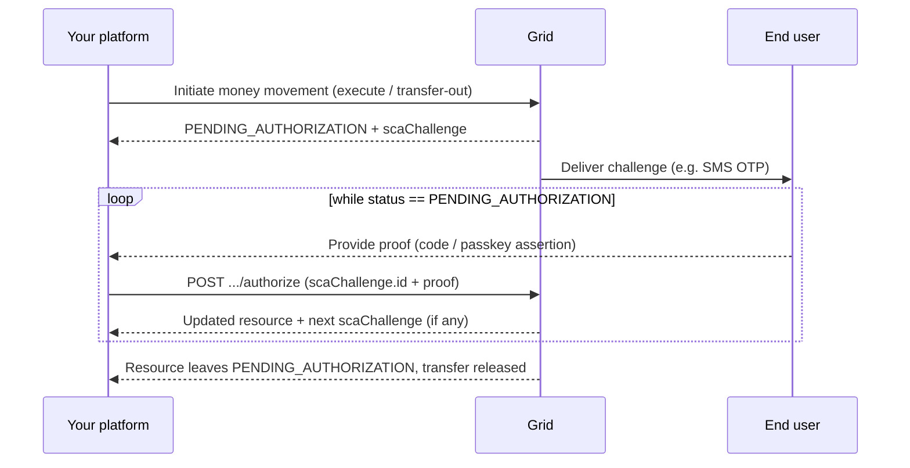

<Note>
**This applies only to customers in a region where Strong Customer Authentication
is required, in practice customers in the EU (EUR / USDC).** For every other
customer none of this appears: money-movement calls complete as usual, no
`scaChallenge` is returned, the authentication endpoints return `409`, and you
can skip this section.
</Note>

Under PSD2, EU e-money and e-money-token (EUR / USDC) money movement must be
confirmed by the end user with Strong Customer Authentication (SCA). Grid wraps
SCA so you satisfy it through the same resources you already use. There is no
separate product to integrate, and the same request shapes work for every
customer whether or not SCA applies.

This section covers the whole surface:

<CardGroup cols={2}>
  <Card title="Per-transaction authorization" icon="/images/icons/lock.svg" href="/platform-overview/sca/per-transaction-authorization">
    Authorize a money movement that came back `PENDING_AUTHORIZATION`. This is the flow you hit most often.
  </Card>
  <Card title="Factor enrollment" icon="/images/icons/key2.svg" href="/platform-overview/sca/factor-enrollment">
    Enroll and manage a customer's TOTP and passkey factors.
  </Card>
  <Card title="Login &amp; sessions" icon="/images/icons/shield.svg" href="/platform-overview/sca/login-and-sessions">
    The end-user SCA login and the session it grants for reads.
  </Card>
  <Card title="Trusted beneficiaries" icon="/images/icons/checkmark1.svg" href="/platform-overview/sca/trusted-beneficiaries">
    Whitelist a payee once so future sends to it skip the per-transaction ceremony.
  </Card>
  <Card title="Two-factor reset" icon="/images/icons/key2.svg" href="/platform-overview/sca/two-factor-reset">
    Recover a customer who has lost their factors, gated by an identity (liveness) check.
  </Card>
</CardGroup>

## What SCA covers

SCA gates **debits** on EU-regulated balances. Reads and non-EUR/USDC accounts
are never gated. "Dynamic linking" means the authorization is cryptographically
bound to the transaction's amount and payee (PSD2 Article 97(2)); it forces a
fresh, transaction-specific challenge, and it's the reason some flows can't use
TOTP (see [Authentication factors](#authentication-factors)).

| Operation | SCA required? | Dynamically linked? |
|---|---|---|
| Send EUR / USDC (SEPA + intra-ledger) | Yes | Yes |
| Convert **from** EUR / USDC (the swap leg) | Yes | Yes |
| On-chain / Lightning withdrawal | Yes | No |
| Trust / untrust a beneficiary | Yes | No |
| Send to an **already-trusted** beneficiary | Lighter, no dynamic linking | No |
| Reading balances / history | Covered by the login session | n/a |
| Non-EUR/USDC accounts (e.g. USD) | No | n/a |

## Authentication factors

The `scaChallenge.availableFactors` field tells you which factors a customer may
use; `scaChallenge.factor` is the one in use (default `SMS_OTP`).

| Factor | Enrollment | Per-transaction debit |
|--------|-----------|-----------------------|
| `SMS_OTP` | None; a code is sent to the customer's verified phone | ✅ Default |
| `PASSKEY` | Required (WebAuthn credential) | ✅ |
| `TOTP` | Required (authenticator app) | ❌ Not permitted (a TOTP code can't be dynamically linked to the amount and payee) |

TOTP is barred from dynamically-linked debits because an authenticator code is
derived only from a clock and a shared secret, so it can't be bound to *this*
amount and payee. It stays valid for flows that don't require dynamic linking:
login, trusting a beneficiary, and sends to an already-trusted beneficiary.

## The authorization flow

For an SCA-required customer, a money-movement call that would otherwise complete
instead returns the resource in status **`PENDING_AUTHORIZATION`** carrying an
**`scaChallenge`**, and the transfer is not released until the challenge is
satisfied. A single money movement can require **more than one** challenge in
sequence, so loop on status rather than assuming one authorization releases the
transfer.

[Per-transaction authorization](/platform-overview/sca/per-transaction-authorization)
covers the mechanics: authorizing the quote, the multi-step loop, resending an
expired code, and the realtime-funding-quote nuance.

## Lifetimes &amp; limits

| Aspect | Behavior |
|---|---|
| Challenge expiry | Each challenge carries an absolute `scaChallenge.expiresAt` (UTC). After it, the challenge can no longer be authorized. |
| Resend | `SMS_OTP` only. Resending reuses the existing challenge and does not extend `expiresAt`; `PASSKEY` (and `TOTP`) codes can't be resent. |
| Repeated failures | Too many failed authorizations may invalidate the challenge and return `429 RATE_LIMITED`, so honor `Retry-After`. |
| Login session | A completed [SCA login](/platform-overview/sca/login-and-sessions) grants a session that covers reads and account access beyond the per-transaction window; when it lapses the customer logs in again. |
| Account lockout | Repeated `FAILED_LOGIN_ATTEMPT` signals escalate a lockout (5 → 15 min, 6 → 30 min, 7 → 1 hour, 8 → 24 hours, 9+ → suspension). See [account-security signals](/platform-overview/sca/login-and-sessions#account-security-signals). |
| 2FA reset window | A started reset carries its own `expiresAt`; complete it before then. |

## Errors you'll encounter

| Status | Meaning | What to do |
|---|---|---|
| `400` | Invalid or expired proof: wrong code, expired challenge, or a factor that can't satisfy this challenge (e.g. `TOTP` on a dynamically-linked debit). | Re-collect the proof. If the code lapsed, resend (`SMS_OTP`) or start over. |
| `409` | SCA isn't required for this customer (non-EU), there's no pending challenge, or the factor's code can't be resent (e.g. `PASSKEY`). | Don't retry the same call. Treat a non-EU `409` as nothing to authorize. |
| `429` | `RATE_LIMITED`: too many attempts or resends, and the challenge may now be invalidated. | Honor `Retry-After`; you may need to restart the flow. |
| `404` | The customer, transaction, quote, external account, or reset wasn't found. | Check the id. |

## Calling a customer outside SCA-regulated regions

Every authentication endpoint returns **`409`** for customers outside
SCA-regulated regions (non-EU), and no `scaChallenge` is ever attached to their
transactions. You don't need to branch on region. Handle `scaChallenge` when it's
present and treat its absence as nothing to do.
