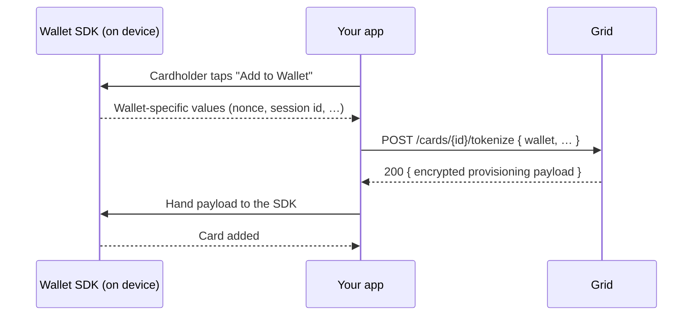

Cardholders can add a Grid-issued card to Apple Pay, Google Pay, or
Samsung Pay in two ways. Manual entry works today for every card and
needs nothing from you. In-app provisioning, an "Add to Wallet" button
in your app, needs approval from each wallet provider plus one API call
to Grid.

## Manual entry

A cardholder opens their wallet app, chooses to add a card, and types in
the card number, expiry, and CVV. The wallet asks
the card network to tokenize the card, Grid approves it, and the card
appears in the wallet.

Use [`POST /cards/{id}/reveal`](/cards/card-management/issuing-cards) to
show the cardholder the details they need to type. Nothing else is
required: no wallet-provider approval, no SDK, no extra endpoint.

<Info>
Some tokenizations require a second factor. The wallet asks the
cardholder to confirm with a one-time code that Grid emails or texts on
your behalf. Brand those messages with `cardTokenization2faConfig` on
[`PATCH /platform/config`](/api-reference/platform/update-platform-configuration).
</Info>

## In-app provisioning: the "Add to Wallet" button

In-app (push) provisioning lets the cardholder add the card from inside
your app with one tap, without typing anything. Each wallet provider
ships a library your app integrates to start that flow:

| Wallet | Wallet SDK | What it hands your app |
|--------|------------|------------------------|
| Apple Pay | PassKit, built into iOS (`PKAddPaymentPassViewController`) | `certificates`, `nonce`, `nonceSignature` |
| Google Pay | Google's TapAndPay SDK for Android | `serverSessionId` and the wallet account id |
| Samsung Pay | Samsung Pay SDK for Android | `walletUserId`, `deviceId` |

When the cardholder taps the button, the wallet SDK produces those
values, which identify the device and the wallet session. Your app sends
them to Grid, an encrypted payload is returned, and the wallet SDK uses
that payload to finish adding the card. The payload is encrypted to the
wallet provider's keys, so neither your app nor your servers ever see
card data.



Only the "Add to Wallet" button requires the setup below. Each wallet
provider must approve your app before its SDK will provision cards, and
the approvals are the slowest step, start them early.

### Apple Pay

1. Your Apple developer account owner submits Apple's
   [In-App Provisioning request form](https://developer.apple.com/contact/passkit/)
   with your company name, app name, Adam ID from App Store Connect,
   sponsor bank, and card program details. Name Lightspark as the
   issuer processor.
2. Apple approves and sends instructions for the
   `com.apple.developer.payment-pass-provisioning` entitlement and the
   pass metadata.
3. Send your Lightspark contact the app's Application Identifiers, Adam
   ID, and launch URL. We register them with the card processor so the
   wallet can hand off to your app.
4. In the app, open Apple's add-to-Wallet screen
   (`PKAddPaymentPassViewController`). When the cardholder continues,
   Apple hands your app three values that identify this device's Wallet
   and this session: `certificates`, `nonce`, and `nonceSignature`. Send
   them to Grid with `POST /cards/{id}/tokenize`.

### Google Pay

1. Request access to Google's
   [Push Provisioning API](https://developers.google.com/pay/issuers/apis/push-provisioning/android)
   through the
   [Push Provisioning API Access Request](https://support.google.com/faqs/contact/pp_api_allowlist)
   form.
2. Submit your "Add to Google Wallet" flow through Google's
   [Push Provisioning API UX Review Request](https://support.google.com/faqs/contact/pp_api_ux)
   form.
3. Google approves and allowlists your app. Integrate the TapAndPay SDK.
4. In the app, start the add-to-Wallet flow through the TapAndPay SDK
   using Google's current flow, Unified Push Provisioning (UPP). Google
   Wallet runs the screens itself and then calls your app back asking for
   the card's payment credentials, handing you a `serverSessionId` that
   identifies this session. Send it, with the wallet account id, to Grid
   with `POST /cards/{id}/tokenize`, and return Grid's payload from that
   callback.

<Warning>
Grid supports UPP only. Google's older push provisioning flow, where the
app fetches the payload before starting the SDK, is being retired at the
end of 2026 and will not work with Grid.
</Warning>

### Samsung Pay

1. Create a Samsung Pay developer account and request access to the
   Samsung Pay developer portal.
2. Create a push provisioning service and register your app for card
   enrollment.
3. Submit your production app for Samsung's review. Once released,
   integrate the Samsung Pay SDK and use Samsung's official
   "Add to Samsung Wallet" button assets.
4. In the app, start the add-to-Wallet flow through the Samsung Pay
   SDK. It hands your app two values that identify the cardholder's
   Samsung Wallet and this device: `walletUserId` and `deviceId`. Send
   them to Grid with `POST /cards/{id}/tokenize`, and pass Grid's payload
   to the SDK's `addCard` call.

## The API call

`POST /cards/{id}/tokenize` takes the wallet name plus the values the
SDK produced and returns the payload the SDK needs. Hand the response
straight back to the SDK.

<Note>
This call is authenticated with your platform credentials like every
other Grid call, so make it from your server and relay the result to
the app rather than embedding the credentials in the app.
</Note>

| `wallet` | Required fields | Optional fields | Response field |
|----------|-----------------|-----------------|----------------|
| `APPLE_PAY` | `certificate`, `nonce`, `nonceSignature` | — | `applePay` |
| `GOOGLE_PAY` | `walletAccountId`, `serverSessionId` | `deviceId`, `opaquePaymentCardRequested` | `provisioningPayload`, plus `googleAccountPayload` when requested |
| `SAMSUNG_PAY` | `walletAccountId`, `deviceId` | — | `provisioningPayload` |

Pass every value exactly as the SDK gave it. `certificate` is the leaf
certificate (the first element of Apple's `certificates` array),
base64-encoded in PEM form; `nonce` and `nonceSignature` are base64.

<Tabs>
  <Tab title="Apple Pay">
    ```bash
    curl -X POST "$GRID_BASE_URL/cards/Card:019542f5-b3e7-1d02-0000-000000000010/tokenize" \
      -u "$GRID_CLIENT_ID:$GRID_CLIENT_SECRET" \
      -H "Content-Type: application/json" \
      -d '{
        "wallet": "APPLE_PAY",
        "certificate": "LS0tLS1CRUdJTiBDRVJUSUZJQ0FURS0tLS0tCk1JSUM=",
        "nonce": "MTIzNDU2Nzg=",
        "nonceSignature": "c2lnbmF0dXJl"
      }'
    ```

    ```json
    {
      "wallet": "APPLE_PAY",
      "applePay": {
        "activationData": "YWN0aXZhdGlvbi1kYXRh",
        "encryptedPassData": "ZW5jcnlwdGVkLXBhc3MtZGF0YQ==",
        "ephemeralPublicKey": "ZXBoZW1lcmFsLXB1YmxpYy1rZXk="
      }
    }
    ```

    Build a `PKAddPaymentPassRequest` from the three `applePay` fields
    and pass it to the delegate's completion handler.
  </Tab>
  <Tab title="Google Pay">
    ```bash
    curl -X POST "$GRID_BASE_URL/cards/Card:019542f5-b3e7-1d02-0000-000000000010/tokenize" \
      -u "$GRID_CLIENT_ID:$GRID_CLIENT_SECRET" \
      -H "Content-Type: application/json" \
      -d '{
        "wallet": "GOOGLE_PAY",
        "walletAccountId": "wallet-account-8f14e45f",
        "serverSessionId": "8c3b8a7e-2a5d-4b7f-9c1e-6d2f0a1b3c4d",
        "opaquePaymentCardRequested": false
      }'
    ```

    ```json
    {
      "wallet": "GOOGLE_PAY",
      "provisioningPayload": "eyJjYXJkIjoiLi4uIn0="
    }
    ```

    Return `provisioningPayload` from the TapAndPay payment-credentials
    callback. When Google's callback asked for an opaque payment card,
    set `opaquePaymentCardRequested: true` and also return the
    `googleAccountPayload` the response then carries.
  </Tab>
  <Tab title="Samsung Pay">
    ```bash
    curl -X POST "$GRID_BASE_URL/cards/Card:019542f5-b3e7-1d02-0000-000000000010/tokenize" \
      -u "$GRID_CLIENT_ID:$GRID_CLIENT_SECRET" \
      -H "Content-Type: application/json" \
      -d '{
        "wallet": "SAMSUNG_PAY",
        "walletAccountId": "wallet-account-8f14e45f",
        "deviceId": "device-3c59dc04"
      }'
    ```

    ```json
    {
      "wallet": "SAMSUNG_PAY",
      "provisioningPayload": "eyJjYXJkIjoiLi4uIn0="
    }
    ```

    Pass `provisioningPayload` to the Samsung Pay SDK's `addCard` call.
  </Tab>
</Tabs>

## Errors

| Status | Code | When |
|--------|------|------|
| `400` | `INVALID_INPUT` | A field the chosen `wallet` requires is missing, a field for a different wallet was supplied, or the wallet provider rejected the values (for example, an expired Apple nonce). Restart the add-to-wallet flow in the app to get fresh values. |
| `404` | `NOT_FOUND` | The card does not exist on your platform. |
| `409` | `CARD_NOT_MUTABLE` | The card is `CLOSED`. |
| `409` | `CONFLICT` | The card is not `ACTIVE`, or its `cardCapabilities.supportsDigitalWalletTokenization` is false. Unfreeze the card first; the capability itself is fixed for the card's lifetime. |
| `501` | `NOT_IMPLEMENTED` | Cards are not enabled in this environment. |

Every call is audit-logged with the requesting actor and the target
wallet. The payload itself is never logged.

## Sandbox

Sandbox cards accept `POST /cards/{id}/tokenize` and return a
well-formed payload, but the wallet SDKs on a real device will not
accept sandbox cards. Test the request shape and error handling against
Sandbox, and the end-to-end device flow against a Production card once
your wallet approvals are in place.
