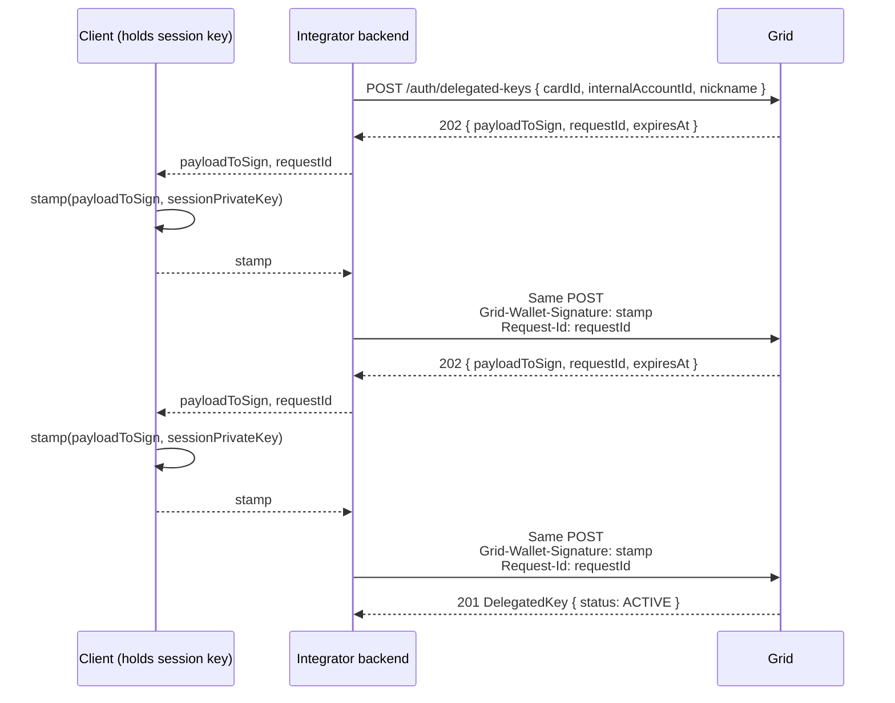

A card can be funded from a customer's Embedded Wallet: an `EMBEDDED_WALLET`
internal account that holds USDB and that only the customer can sign for.
Grid cannot debit that account the way it debits a custodial funding source,
and a card authorization has to be answered in seconds, so the cardholder
cannot sign each purchase. Instead the cardholder authorizes a **delegated
key** once. Grid custodies the key and uses it to sign the pull from the
wallet at every authorization.

This page covers issuing the card, creating the delegated key, what happens
when an authorization arrives, and what fails when the card has no active
key.

## Prerequisites

- Cards are enabled for your platform, and your Lightspark contact has
  enabled Embedded Wallet card funding for it.
- The cardholder is a `Customer` with `kycStatus: APPROVED` and has an
  `EMBEDDED_WALLET` internal account. To find it, list the customer's
  internal accounts with `GET /internal-accounts?customerId=...` and pick
  the account with `type: "EMBEDDED_WALLET"`.
- The wallet is provisioned. Grid provisions the wallet's signer the first
  time a credential on the account is verified, so the cardholder must have
  completed at least one credential verification. See
  [Authentication](/global-accounts/authentication).
- Your client can hold a session signing key and stamp a `payloadToSign`.
  Creating the delegated key needs two stamps from the cardholder's active
  session. See [Client keys](/global-accounts/client-keys).
- The wallet holds USDB on Spark. Each authorization spends the wallet's
  on-chain balance at authorization time.

## How the pieces fit

1. You issue the card with the wallet account as its `fundingSource`.
2. The cardholder authorizes a delegated key for that card and account
   through a three-leg signed-retry flow. Grid generates the keypair,
   registers it as a signer on the wallet, and keeps the private key.
3. When an authorization arrives, Grid runs its usual decisioning, then pays
   the hold from the wallet: it builds a USDB transfer for the authorized
   amount, signs it with the delegated key, and broadcasts it on Spark.
4. Clearings capture the held USDB. Reversals and expiries return it to the
   wallet. Neither needs the cardholder.

## Issue the card

Issue the card the same way as any other, with the Embedded Wallet account
as the funding source:

```bash
curl -X POST "$GRID_BASE_URL/cards" \
  -u "$GRID_CLIENT_ID:$GRID_CLIENT_SECRET" \
  -H "Content-Type: application/json" \
  -d '{
    "customerId": "Customer:019542f5-b3e7-1d02-0000-000000000001",
    "form": "VIRTUAL",
    "fundingSource": "InternalAccount:019542f5-b3e7-1d02-0000-000000000002",
    "maxSpendPerTransaction": 5000,
    "maxSpendPerDay": 25000
  }'
```

The card's `currency` is `USD`. The wallet holds USDB, which Grid converts
1:1, so a $12.50 authorization pulls 12.50 USDB.

The card comes back in `status: "PROCESSING"` and activates through the
`CARD.STATUS_CHANGE` webhook as described in
[Issuing cards](/cards/card-management/issuing-cards). An `ACTIVE` card with
no active delegated key declines every authorization, so complete the next
section before you show the card to the cardholder.

Set `maxSpendPerTransaction` and `maxSpendPerDay`. The delegated key itself
carries no limits: while it is `ACTIVE`, Grid can sign any transfer from the
wallet with it. The card's spend limits are the control on how much a
compromised card can pull.

## Create the delegated key

`POST /auth/delegated-keys` is a three-leg flow. Every leg sends the same
body; the second and third legs add a stamp from the cardholder's session
signing key. Your backend relays each `payloadToSign` to the client and the
resulting stamp back to Grid, the same shape as
[passkey registration](/global-accounts/authentication#passkey-registration).



### Leg 1: request the challenge

Send the request with no signature headers. `cardId` and
`internalAccountId` identify the card funding source; the account must be
the card's current `fundingSource`.

```bash
curl -X POST "$GRID_BASE_URL/auth/delegated-keys" \
  -u "$GRID_CLIENT_ID:$GRID_CLIENT_SECRET" \
  -H "Content-Type: application/json" \
  -d '{
    "cardId": "Card:019542f5-b3e7-1d02-0000-000000000010",
    "internalAccountId": "InternalAccount:019542f5-b3e7-1d02-0000-000000000002",
    "nickname": "Card payments key"
  }'
```

Grid generates the keypair and returns `202`:

```json
{
  "payloadToSign": "{\"type\":\"ACTIVITY_TYPE_CREATE_USERS_V3\",...}",
  "requestId": "Request:7c4a8d09-ca37-4e3e-9e0d-8c2b3e9a1f21",
  "expiresAt": "2026-05-08T14:15:00Z"
}
```

Each challenge expires five minutes after it is issued. If the cardholder
takes longer, start again from leg 1.

### Leg 2: authorize the signer

The client stamps `payloadToSign` byte for byte with the session signing
key. Retry the same request with the stamp in `Grid-Wallet-Signature` and
the `requestId` in `Request-Id`:

```bash
curl -X POST "$GRID_BASE_URL/auth/delegated-keys" \
  -u "$GRID_CLIENT_ID:$GRID_CLIENT_SECRET" \
  -H "Content-Type: application/json" \
  -H "Grid-Wallet-Signature: $STAMP" \
  -H "Request-Id: Request:7c4a8d09-ca37-4e3e-9e0d-8c2b3e9a1f21" \
  -d '{
    "cardId": "Card:019542f5-b3e7-1d02-0000-000000000010",
    "internalAccountId": "InternalAccount:019542f5-b3e7-1d02-0000-000000000002",
    "nickname": "Card payments key"
  }'
```

Grid registers the key as a signer on the wallet and returns a second `202`
with a new `payloadToSign` and `requestId`. The key now exists in
`PENDING` status: the signer is registered but holds no signing policy yet,
so it cannot sign.

### Leg 3: grant the signing policy

The client stamps the new `payloadToSign`. Retry once more with the new
`Request-Id`. The response is `201` with the key in `ACTIVE` status:

```json
{
  "id": "DelegatedKey:019542f5-b3e7-1d02-0000-000000000021",
  "cardId": "Card:019542f5-b3e7-1d02-0000-000000000010",
  "fundingSourceId": "CardFundingSource:019542f5-b3e7-1d02-0000-000000000011",
  "accountId": "InternalAccount:019542f5-b3e7-1d02-0000-000000000002",
  "publicKey": "02a1b2c3d4e5f60718293a4b5c6d7e8f90a1b2c3d4e5f60718293a4b5c6d7e8f90",
  "nickname": "Card payments key",
  "status": "ACTIVE",
  "createdAt": "2026-05-08T14:12:01Z",
  "updatedAt": "2026-05-08T14:12:42Z"
}
```

The private key never leaves Grid. `publicKey` identifies the credential and
is not needed for anything else.

### Rules

- A card funding source has at most one `ACTIVE` key. A second create
  returns `409 CONFLICT` until you revoke the first.
- A flow abandoned after leg 2 leaves a `PENDING` key. It cannot sign and
  does not block creating another key.
- The key does not expire. It stays `ACTIVE` until you revoke it.
- The key is bound to the pair of card and funding account. If you replace
  the card's `fundingSource` with a different account, create a new key for
  the new pairing and revoke the old one.

### Errors

| Status | Code | What it means |
|--------|------|---------------|
| 400 | `INVALID_INPUT` | `internalAccountId` is not an `EMBEDDED_WALLET` account, or the wallet is not provisioned yet. Verify a credential on the account first. |
| 401 | `UNAUTHORIZED` | The stamp is missing on a retry, does not verify against an active session on the account, or `Request-Id` does not match an unexpired challenge. |
| 404 | `NOT_FOUND` | The card or account is not on your platform, or the account is not the card's current funding source. |
| 409 | `CONFLICT` | The funding source already has an `ACTIVE` delegated key. Revoke it with `DELETE /auth/delegated-keys/{id}` first. |

## What happens at authorization

When the network asks Grid to authorize a purchase on the card:

1. Grid applies the same checks as for any card: the card is `ACTIVE`, the
   amount is within the card's and the platform's spend limits, and program
   rules allow the merchant.
2. Grid builds a USDB transfer from the wallet for the authorized amount,
   signs it with the delegated key, and broadcasts it on Spark. The wallet's
   balance drops by the authorized amount now, not at clearing.
3. Grid approves the authorization once the broadcast is accepted and sends
   `CARD_TRANSACTION.AUTHORIZED`. `accountId` on the transaction is the
   wallet account.

Later events on the transaction:

- **Clearing.** Grid captures the held USDB. The wallet is not touched
  again for the authorized amount. If the merchant clears for more than the
  authorization, Grid pulls the difference from the wallet the same way it
  pulled the hold, signed with the delegated key.
- **Reversal or expiry.** Grid returns the held USDB to the wallet on Spark.
  The return is a separate on-chain transfer into the wallet and does not
  use the delegated key.

Two behaviors differ from a custodial funding source:

- **The balance check is real and synchronous.** Grid selects the wallet's
  USDB outputs before it signs. If the wallet cannot cover the amount, the
  authorization is declined, and no hold is placed.
- **Approval waits on the broadcast.** The authorization is approved only
  after the signed transfer has been accepted by the Spark network.

## What fails without an active key

Grid checks for the delegated key when it goes to sign the pull, not before.
If the card's funding source has no `ACTIVE` key (never created, still
`PENDING`, or revoked), the signing step fails and Grid declines the
authorization. Nothing is pulled from the wallet.

The card transaction is recorded with `status: "DECLINED"` and
`cardDeclinedReason: "OTHER"`, and a `CARD_TRANSACTION.DECLINED` webhook
fires. The decline does not name the missing key, so check for it directly
when you investigate a declined card funded from a wallet:

```bash
curl -X GET "$GRID_BASE_URL/auth/delegated-keys?fundingSourceId=CardFundingSource:019542f5-b3e7-1d02-0000-000000000011" \
  -u "$GRID_CLIENT_ID:$GRID_CLIENT_SECRET"
```

An empty `data` array, or one with no `ACTIVE` entry, means every
authorization on that card declines until the cardholder completes the
three-leg flow again.

The same decline path applies when the cardholder revokes the key: the card
stays `ACTIVE`, and every authorization declines. To stop a card from
spending without touching the key, freeze it with `PATCH /cards/{id}` and
`status: "FROZEN"`.

## Manage the key

List the keys for an account or a funding source. At least one filter is
required. `PENDING` and `REVOKED` keys are included:

```bash
curl -X GET "$GRID_BASE_URL/auth/delegated-keys?accountId=InternalAccount:019542f5-b3e7-1d02-0000-000000000002" \
  -u "$GRID_CLIENT_ID:$GRID_CLIENT_SECRET"
```

Revoke a key. No signature is needed; Grid uses the custodied key to remove
its own signer from the wallet:

```bash
curl -X DELETE "$GRID_BASE_URL/auth/delegated-keys/DelegatedKey:019542f5-b3e7-1d02-0000-000000000021" \
  -u "$GRID_CLIENT_ID:$GRID_CLIENT_SECRET"
```

The response is `204`. Revoking a key that is not `ACTIVE` returns
`400 INVALID_INPUT`. Revocation is permanent. To let the card spend again,
run the three-leg flow to create a new key.

Revoke the key when the card is closed or when the cardholder asks to
withdraw Grid's authority over the wallet. Closing the card does not revoke
the key.

## Testing in Sandbox

The flow is the same in Sandbox. Sandbox wallets run on Spark regtest, and a
sandbox authorization pulls regtest USDB from the wallet into a sandbox
treasury.

- Sandbox accepts a real session stamp on the delegated-key legs. The
  legacy value `Grid-Wallet-Signature: sandbox-valid-signature` is also
  accepted.
- `POST /sandbox/internal-accounts/{id}/fund` credits the account's ledger
  balance only. A card hold spends the wallet's balance on Spark, so fund
  the wallet with a quote whose destination is the wallet account, as
  described in the [Global Accounts walkthrough](/global-accounts/implementation-overview),
  before you simulate an authorization.
- `POST /sandbox/cards/{id}/simulate/authorization` with any non-magic
  descriptor drives the pull. Run it once with the key in place and once
  after revoking the key to see both outcomes.

See [Sandbox testing](/cards/platform-tools/sandbox-testing) for the
simulate endpoints and the descriptor suffixes.
