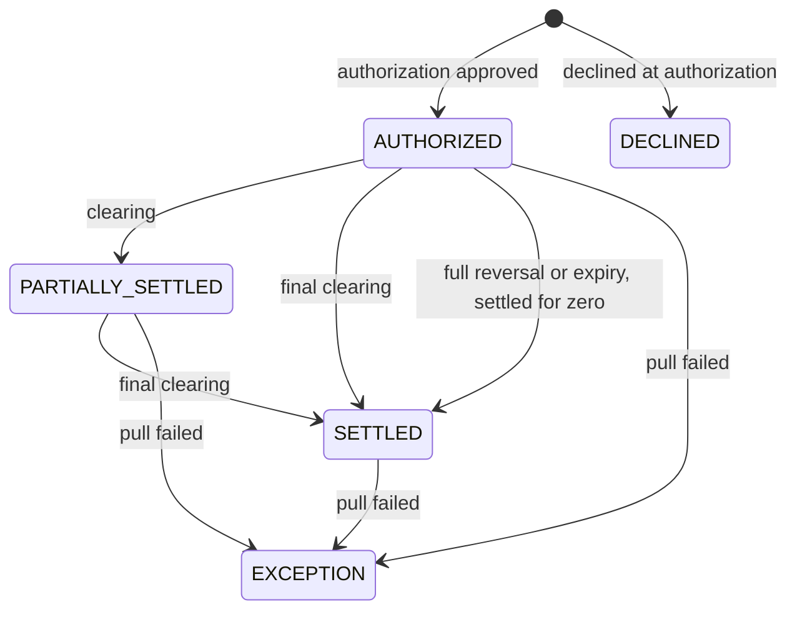

A card transaction is not a single event. It is a parent row plus a
stream of child events from the card network. This page covers the
event model, status transitions, and declined authorizations. It also
explains how to handle the `EXCEPTION` path.

## The event model

For each card authorization, Grid produces:

1. **One parent `CardTransaction`** — created at auth time, persists for
   the life of the transaction.
2. **Pulls** — debits against the funding source that fund approved
   auths and any post-hoc settlements.
3. **Clearings** — the network's confirmation that funds have moved.
4. **Refunds** — merchant-initiated `RETURN` events.

Children are reconciled against the parent and rolled up into three
aggregates: `pullSummary`, `settlementSummary`, and `refundSummary`.
You don't see per-child rows on the list endpoint — they're summarized
on the parent.

## Status transitions

A merchant `RETURN` does not move the status. The transaction stays
`SETTLED` and the returned value appears in `refundedAmount`.
A partial authorization reversal releases part of the hold and lowers
`authorizedAmount`; the transaction stays `AUTHORIZED`. A full reversal or
an expiry releases the whole hold and resolves the transaction as `SETTLED`
with `settledAmount` of zero.

| Status | Meaning |
|--------|---------|
| `AUTHORIZED` | Auth approved, hold placed, no clearings yet. |
| `DECLINED` | The authorization was declined. Nothing was pulled from the funding source, and the status is terminal. See `cardDeclinedReason`. |
| `PARTIALLY_SETTLED` | At least one clearing landed, but more are still expected (split shipments, multi-leg trips). |
| `SETTLED` | All clearings for the auth have posted. The transaction is closed against the funding source. A `RETURN` received afterwards keeps it `SETTLED` with the returned value in `refundedAmount`. |
| `EXCEPTION` | The transaction settled to the card network, but the pull from the funding source failed. This high-urgency state needs operator reconciliation. |

Every transition is delivered by the card transaction webhook, which
carries the post-change `CardTransaction`. For the event types, see
[Webhooks](/cards/platform-tools/webhooks).

## The over-auth path

The most common non-trivial flow is the over-auth (e.g. restaurant
tip). The auth comes in at $12.50, but the merchant clears for $15.00.

1. Auth approved → one pull for $12.50 → parent is `AUTHORIZED`.
2. Clearing for $15.00 → second post-hoc pull for $2.50 → parent is
   `SETTLED` with `pullSummary.count = 2`,
   `settlementSummary.totalAmount = 1500`.

The post-settlement parent carries `authorizedAmount: 1250`,
`settledAmount: 1500`, and two pulls in its `pullSummary`.

## The EXCEPTION path

An exception happens when the card network has already moved funds for
a settlement but Grid can't pull the matching amount from the funding
source — typically because the cardholder's balance no longer covers
the post-hoc difference.

Signal to watch: a transaction webhook with `status: "EXCEPTION"` for
a card-destination transaction. The payload includes the full parent
record, so your dashboard's exception view is driven entirely by
webhook deliveries — there's no list endpoint to poll.

Exceptions don't roll back automatically. The standard response is to
top up the funding source (or move the customer to a state where their
balance can be collected) and contact Lightspark support to drive the
exception to resolution.

## Idempotency on webhooks

Every transaction webhook carries a unique `id`. Track processed
webhook IDs and treat duplicates as no-ops — Grid retries failed
deliveries, and your reconciliation should be safe under at-least-once
delivery.

See [Webhooks](/cards/platform-tools/webhooks) for signature
verification and the full payload shape.
