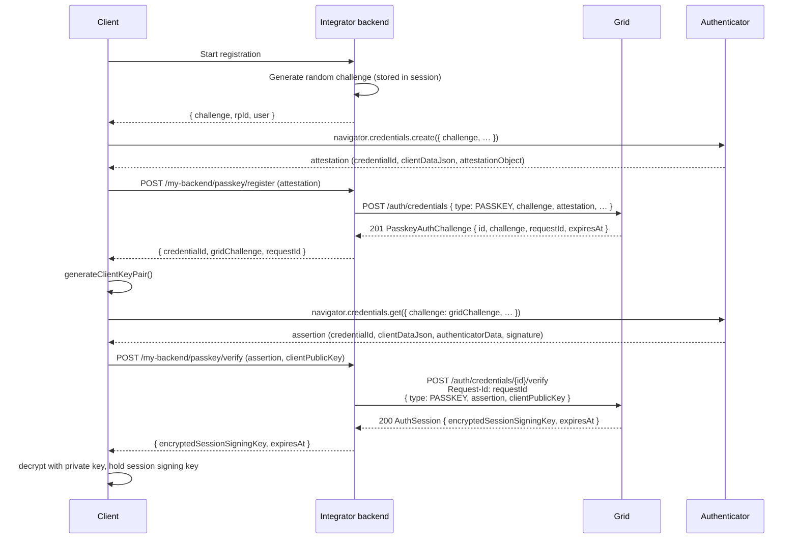
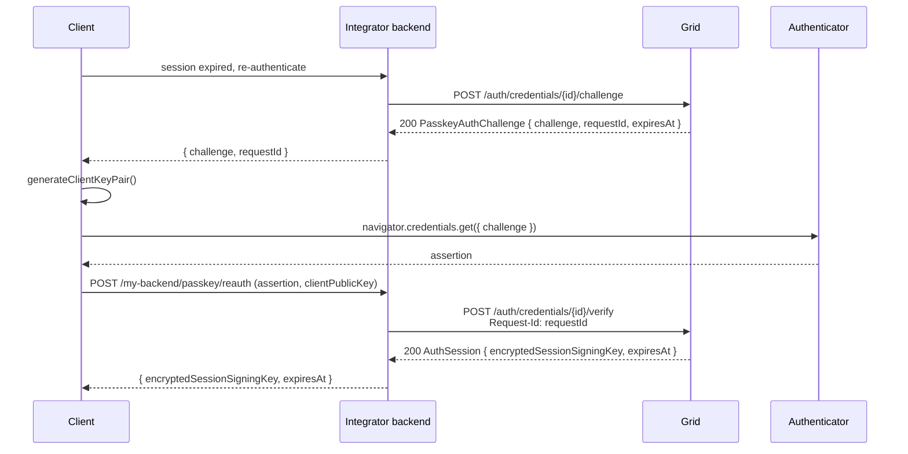
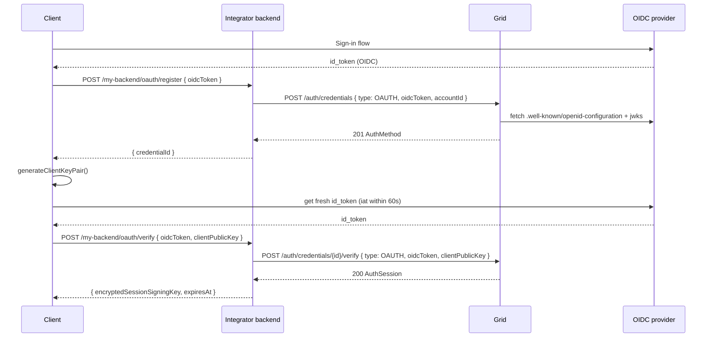
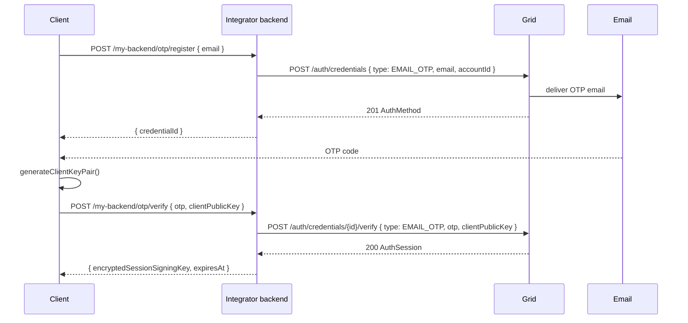
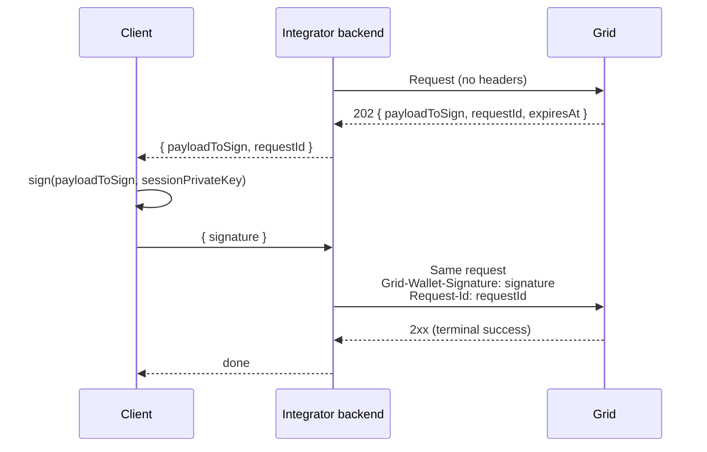

Every Embedded Wallet action beyond receiving funds must be authorized by a session signing key. Sessions are issued by verifying one of three **credential types** on the wallet's internal account:

| Type | When to use it |
|---|---|
| **`PASSKEY`** | Best default. Biometric, phishing-resistant, usable across the user's devices via iCloud Keychain / Google Password Manager. |
| **`OAUTH`** | Your platform already authenticates the user via OIDC (Google, Apple, your own IdP) and you want Grid to trust the same identity. |
| **`EMAIL_OTP`** | Lowest-friction option. Works on any device with email access — no biometric hardware, identity provider, or client SDK required beyond the code entry field. |

A single internal account can hold one credential of each type concurrently. Only one `PASSKEY` and one `EMAIL_OTP` per account in v1.

## Registration vs. verification

Every credential type uses the same two-step shape:

1. **`POST /auth/credentials`** creates the credential record. This triggers the out-of-band channel (OTP email sent, WebAuthn attestation stored) but does not yet issue a session.
2. **`POST /auth/credentials/{id}/verify`** completes activation by presenting proof of control (the OTP value, a fresh OIDC token, or a WebAuthn assertion) plus a `clientPublicKey`. The response carries the `encryptedSessionSigningKey`.

Re-authentication after a session expires skips the original `POST /auth/credentials` create call, but still needs a fresh challenge for `PASSKEY` and `EMAIL_OTP` — call `POST /auth/credentials/{id}/challenge` first (to re-issue the WebAuthn challenge or send a new OTP email), then `POST /auth/credentials/{id}/verify`. `OAUTH` is the exception — since proof of control is a fresh OIDC token, there's nothing to pre-issue, so `/verify` alone suffices. Each credential type's re-auth path is covered in its section below.

## Passkey

### Passkey registration

Passkey registration spans four parties: the **client** (browser or app), your **integrator backend**, **Grid**, and the platform authenticator (Touch ID / Face ID / Windows Hello / a security key). Your backend issues the WebAuthn registration challenge; Grid issues the subsequent authentication challenge used to prove that the passkey actually works end-to-end before a session is issued.



The `challenge` on `POST /auth/credentials` is the one your backend issued. Grid rebinds to a fresh challenge for the *first* authentication and hands it back on the 201 response as `PasskeyAuthChallenge.challenge` with an accompanying `requestId`.

<Tip>
  Passkeys are domain-bound. Before shipping, set up your `/.well-known/apple-app-site-association` and `/.well-known/assetlinks.json` entries so the platform authenticator binds the passkey to your origin and app bundles:
  - Web: [passkeys.dev bootstrapping guide](https://passkeys.dev/docs/use-cases/bootstrapping/#opting-the-user-into-passkeys)
  - Android: [Create passkeys on Android](https://developer.android.com/identity/passkeys/create-passkeys)
  - iOS: [Supporting passkeys](https://developer.apple.com/documentation/authenticationservices/supporting-passkeys)
</Tip>

#### Client sample code

The client never talks to Grid. It talks to your integrator backend — the snippets below simulate that call with `fetch('/my-backend/...')`, which your backend then relays to Grid.

<CodeGroup>
```typescript Web (TypeScript)
// 1. Ask your backend for a registration challenge.
const startRes = await fetch("/my-backend/passkey/register/start", {
  method: "POST",
  credentials: "include",
});
const { challenge, rpId, user } = await startRes.json();

// 2. Ask the authenticator to create a passkey.
const attestation = (await navigator.credentials.create({
  publicKey: {
    challenge: base64urlToBytes(challenge),
    rp: { id: rpId, name: "Acme Wallet" },
    user: {
      id: base64urlToBytes(user.id),
      name: user.email,
      displayName: user.displayName,
    },
    pubKeyCredParams: [{ type: "public-key", alg: -7 }], // ES256
    authenticatorSelection: { residentKey: "required", userVerification: "required" },
    timeout: 60_000,
  },
})) as PublicKeyCredential;
const att = attestation.response as AuthenticatorAttestationResponse;

// 3. Send the attestation to your backend, which calls POST /auth/credentials.
const registerRes = await fetch("/my-backend/passkey/register", {
  method: "POST",
  credentials: "include",
  headers: { "Content-Type": "application/json" },
  body: JSON.stringify({
    nickname: "This device",
    credentialId: bytesToBase64url(new Uint8Array(attestation.rawId)),
    clientDataJson: bytesToBase64url(new Uint8Array(att.clientDataJSON)),
    attestationObject: bytesToBase64url(new Uint8Array(att.attestationObject)),
    transports: att.getTransports?.() ?? [],
  }),
});
const { credentialId, gridChallenge, requestId } = await registerRes.json();

// 4. Generate the client key pair and run an assertion against the Grid-issued challenge.
const { keyPair, publicKeyHex } = await generateClientKeyPair();
const assertion = (await navigator.credentials.get({
  publicKey: {
    challenge: base64urlToBytes(gridChallenge),
    rpId,
    userVerification: "required",
    allowCredentials: [{ type: "public-key", id: base64urlToBytes(credentialId) }],
  },
})) as PublicKeyCredential;
const asr = assertion.response as AuthenticatorAssertionResponse;

// 5. Send the assertion + client public key to your backend; it relays to POST /verify.
const verifyRes = await fetch("/my-backend/passkey/verify", {
  method: "POST",
  credentials: "include",
  headers: { "Content-Type": "application/json" },
  body: JSON.stringify({
    credentialId,
    requestId,
    assertion: {
      credentialId: bytesToBase64url(new Uint8Array(assertion.rawId)),
      clientDataJson: bytesToBase64url(new Uint8Array(asr.clientDataJSON)),
      authenticatorData: bytesToBase64url(new Uint8Array(asr.authenticatorData)),
      signature: bytesToBase64url(new Uint8Array(asr.signature)),
      userHandle: asr.userHandle
        ? bytesToBase64url(new Uint8Array(asr.userHandle))
        : null,
    },
    clientPublicKey: publicKeyHex,
  }),
});
const { encryptedSessionSigningKey, expiresAt } = await verifyRes.json();
// Decrypt and cache the session signing key — see client-keys.mdx.
```

```kotlin Android (Kotlin)
// Uses Jetpack Credential Manager.
// implementation("androidx.credentials:credentials:1.3.0")
// implementation("androidx.credentials:credentials-play-services-auth:1.3.0")
import androidx.credentials.CreatePublicKeyCredentialRequest
import androidx.credentials.CredentialManager
import androidx.credentials.GetCredentialRequest
import androidx.credentials.GetPublicKeyCredentialOption
import androidx.credentials.PublicKeyCredential

suspend fun registerPasskey(context: Context, api: MyBackendApi): EmbeddedWalletSession {
    // 1. Backend → WebAuthn registration options JSON (challenge, rp, user, ...).
    val createOptionsJson = api.passkeyRegisterStart()

    val cm = CredentialManager.create(context)

    // 2. Authenticator creates the passkey.
    val createResp = cm.createCredential(
        context = context,
        request = CreatePublicKeyCredentialRequest(createOptionsJson),
    ) as androidx.credentials.CreatePublicKeyCredentialResponse
    val attestationJson = createResp.registrationResponseJson

    // 3. Backend → POST /auth/credentials. Returns Grid-issued challenge + requestId.
    val registerResp = api.passkeyRegister(attestationJson, nickname = "This device")

    // 4. Generate client key pair and run assertion against Grid-issued challenge.
    val clientKeys = generateClientKeyPair(alias = "embedded-wallet-${registerResp.credentialId}")
    val getOptionsJson = buildWebAuthnGetOptionsJson(
        challenge = registerResp.gridChallenge,
        rpId = registerResp.rpId,
        credentialId = registerResp.credentialId,
    )
    val getResp = cm.getCredential(
        context = context,
        request = GetCredentialRequest(listOf(GetPublicKeyCredentialOption(getOptionsJson))),
    ).credential as PublicKeyCredential
    val assertionJson = getResp.authenticationResponseJson

    // 5. Backend → POST /verify. Returns encryptedSessionSigningKey.
    return api.passkeyVerify(
        credentialId = registerResp.credentialId,
        requestId = registerResp.requestId,
        assertionJson = assertionJson,
        clientPublicKeyHex = clientKeys.publicKeyHex,
    )
}
```

```swift iOS (Swift)
import AuthenticationServices

final class PasskeyCoordinator: NSObject, ASAuthorizationControllerDelegate {
    private let api: MyBackendApi
    private var continuation: CheckedContinuation<EmbeddedWalletSession, Error>?
    private var clientKeys: ClientKeyPair?
    private var pendingCredentialId: String?
    private var pendingRequestId: String?

    init(api: MyBackendApi) { self.api = api }

    func registerPasskey() async throws -> EmbeddedWalletSession {
        // 1. Backend → WebAuthn registration options.
        let options = try await api.passkeyRegisterStart()

        // 2. Authenticator creates the passkey.
        let provider = ASAuthorizationPlatformPublicKeyCredentialProvider(
            relyingPartyIdentifier: options.rpId,
        )
        let request = provider.createCredentialRegistrationRequest(
            challenge: options.challenge,
            name: options.user.name,
            userID: options.user.id,
        )
        let attestation = try await withCheckedThrowingContinuation {
            (cont: CheckedContinuation<
                ASAuthorizationPlatformPublicKeyCredentialRegistration, Error
            >) in
            let controller = ASAuthorizationController(authorizationRequests: [request])
            controller.delegate = AttestationDelegate(cont: cont)
            controller.performRequests()
        }

        // 3. Backend → POST /auth/credentials.
        let registered = try await api.passkeyRegister(
            credentialId: attestation.credentialID.base64URLEncoded,
            clientDataJson: attestation.rawClientDataJSON.base64URLEncoded,
            attestationObject: attestation.rawAttestationObject!.base64URLEncoded,
            nickname: "This device",
        )

        // 4. Generate client key pair, run assertion against Grid challenge.
        let keys = generateClientKeyPair()
        let assertRequest = provider.createCredentialAssertionRequest(
            challenge: registered.gridChallenge,
        )
        assertRequest.allowedCredentials = [
            ASAuthorizationPlatformPublicKeyCredentialDescriptor(
                credentialID: Data(base64URLEncoded: registered.credentialId)!,
            ),
        ]
        let assertion = try await withCheckedThrowingContinuation {
            (cont: CheckedContinuation<
                ASAuthorizationPlatformPublicKeyCredentialAssertion, Error
            >) in
            let controller = ASAuthorizationController(authorizationRequests: [assertRequest])
            controller.delegate = AssertionDelegate(cont: cont)
            controller.performRequests()
        }

        // 5. Backend → POST /verify.
        return try await api.passkeyVerify(
            credentialId: registered.credentialId,
            requestId: registered.requestId,
            clientDataJson: assertion.rawClientDataJSON.base64URLEncoded,
            authenticatorData: assertion.rawAuthenticatorData.base64URLEncoded,
            signature: assertion.signature.base64URLEncoded,
            userHandle: assertion.userID?.base64URLEncoded,
            clientPublicKeyHex: keys.publicKeyHex,
        )
    }
}
```
</CodeGroup>

#### WebAuthn → Grid parameter map

These are the fields you need to pass through on each hop.

**Registration (`/auth/credentials`):**

| Browser (`credential`) | Your backend payload | Grid request body |
|---|---|---|
| `credential.rawId` | `credentialId` | `attestation.credentialId` |
| `response.clientDataJSON` | `clientDataJson` | `attestation.clientDataJson` |
| `response.attestationObject` | `attestationObject` | `attestation.attestationObject` |
| `response.getTransports()` | `transports` | `attestation.transports` |
| *(backend session state)* | `challenge` | `challenge` *(top-level, not under `attestation`)* |
| *(backend-chosen)* | `nickname` | `nickname` |
| *(Grid account id)* | — | `accountId` |

**Assertion (`/auth/credentials/{id}/verify` and passkey reauthentication):**

| Browser (`credential`) | Your backend payload | Grid request body |
|---|---|---|
| `credential.rawId` | `credentialId` | `assertion.credentialId` |
| `response.clientDataJSON` | `clientDataJson` | `assertion.clientDataJson` |
| `response.authenticatorData` | `authenticatorData` | `assertion.authenticatorData` |
| `response.signature` | `signature` | `assertion.signature` |
| `response.userHandle` | `userHandle` | `assertion.userHandle` *(optional)* |
| *(from 201/200 challenge response)* | `requestId` | `Request-Id` header |
| *(client-generated)* | `clientPublicKey` | `clientPublicKey` |

<Note>
  The WebAuthn spec names the field `clientDataJSON`. Grid spells it `clientDataJson` (lowercase `json`) for consistency with the rest of the API. The **bytes are identical** — only the field name changes.
</Note>

### Passkey reauthentication

When a session expires the client re-verifies without recreating the credential. Call `POST /auth/credentials/{id}/challenge` for a fresh Grid-issued challenge, run `navigator.credentials.get()`, then call `/verify` with the assertion and a new `clientPublicKey`.



## OAuth (OIDC)

Use an OAuth credential when your platform already authenticates the user with an OpenID Connect identity provider (Google, Apple, your own IdP) and you want Grid to trust that same identity.

### OAuth registration



Grid validates the OIDC token signature against the issuer's JWKS on every call and requires `iat` to be no more than **60 seconds** older than the request. Use a fresh token for each `verify` call; cached tokens will fail.

```bash
curl -X POST "$GRID_BASE_URL/auth/credentials" \
  -u "$GRID_CLIENT_ID:$GRID_CLIENT_SECRET" \
  -H "Content-Type: application/json" \
  -d '{
    "type": "OAUTH",
    "accountId": "EmbeddedWallet:019542f5-b3e7-1d02-0000-000000000002",
    "oidcToken": "eyJhbGciOiJSUzI1NiIsImtpZCI6ImFiYzEyMyIsInR5cCI6IkpXVCJ9..."
  }'
```

**Response:** `201 AuthMethod` with `nickname` populated from the OIDC token's `email` claim.

### OAuth verify / reauthentication

`POST /auth/credentials/{id}/verify` is also the reauthentication path — call it with a fresh OIDC token whenever the session expires.

```bash
curl -X POST "$GRID_BASE_URL/auth/credentials/AuthMethod:019542f5-b3e7-1d02-0000-000000000001/verify" \
  -u "$GRID_CLIENT_ID:$GRID_CLIENT_SECRET" \
  -H "Content-Type: application/json" \
  -d '{
    "type": "OAUTH",
    "oidcToken": "eyJhbGciOiJSUzI1NiIsImtpZCI6ImFiYzEyMyIsInR5cCI6IkpXVCJ9...",
    "clientPublicKey": "04f45f2a22c908b9ce09a7150e514afd24627c401c38a4afc164e1ea783adaaa31d4245acfb88c2ebd42b47628d63ecabf345484f0a9f665b63c54c897d5578be2"
  }'
```

## Email OTP

The lowest-friction credential type — works on any device with email access and requires no biometric hardware, identity provider, or client-side setup beyond an input field for the code.

### Email OTP registration

Creating the credential triggers an OTP email to the address you pass. The user reads the code off the email and submits it through your UI.



```bash
curl -X POST "$GRID_BASE_URL/auth/credentials" \
  -u "$GRID_CLIENT_ID:$GRID_CLIENT_SECRET" \
  -H "Content-Type: application/json" \
  -d '{
    "type": "EMAIL_OTP",
    "accountId": "EmbeddedWallet:019542f5-b3e7-1d02-0000-000000000002",
    "email": "jane@example.com"
  }'
```

**Response (201):**

```json
{
  "id": "AuthMethod:019542f5-b3e7-1d02-0000-000000000004",
  "accountId": "EmbeddedWallet:019542f5-b3e7-1d02-0000-000000000002",
  "type": "EMAIL_OTP",
  "nickname": "jane@example.com",
  "createdAt": "2026-04-19T12:00:00Z",
  "updatedAt": "2026-04-19T12:00:00Z"
}
```

Then complete activation with the OTP value:

```bash
curl -X POST "$GRID_BASE_URL/auth/credentials/AuthMethod:019542f5-b3e7-1d02-0000-000000000004/verify" \
  -u "$GRID_CLIENT_ID:$GRID_CLIENT_SECRET" \
  -H "Content-Type: application/json" \
  -d '{
    "type": "EMAIL_OTP",
    "otp": "123456",
    "clientPublicKey": "04f45f2a22c908b9ce09a7150e514afd24627c401c38a4afc164e1ea783adaaa31d4245acfb88c2ebd42b47628d63ecabf345484f0a9f665b63c54c897d5578be2"
  }'
```

### Resending an OTP

If the code expires or the email didn't arrive, re-issue the challenge with `POST /auth/credentials/{id}/challenge`. This sends a fresh OTP email and leaves the `AuthMethod` otherwise untouched.

```bash
curl -X POST "$GRID_BASE_URL/auth/credentials/AuthMethod:019542f5-b3e7-1d02-0000-000000000004/challenge" \
  -u "$GRID_CLIENT_ID:$GRID_CLIENT_SECRET"
```

<Warning>
  Challenge re-issues are rate-limited. On `429`, back off for the duration returned in the `Retry-After` header before retrying.
</Warning>

### Email OTP reauthentication

Same pattern as the first activation: call `/challenge` to send a new OTP, then `/verify` with the new code and a fresh `clientPublicKey`.

## Managing credentials

Every Embedded Wallet starts with a single credential — the one used in the <a href="overview#quickstart">quickstart</a>. In production, encourage customers to register a second credential of a different type (e.g., an email OTP alongside a passkey) so the wallet is recoverable if their primary device is lost. Adding, revoking, and rotating credentials after the first all go through the same **two-step signed-retry** pattern.

### List credentials

```bash
curl -X GET "$GRID_BASE_URL/auth/credentials?accountId=EmbeddedWallet:019542f5-b3e7-1d02-0000-000000000002" \
  -u "$GRID_CLIENT_ID:$GRID_CLIENT_SECRET"
```

**Response (200):**

```json
{
  "data": [
    {
      "id": "AuthMethod:019542f5-b3e7-1d02-0000-000000000001",
      "accountId": "EmbeddedWallet:019542f5-b3e7-1d02-0000-000000000002",
      "type": "PASSKEY",
      "nickname": "iPhone Face-ID",
      "createdAt": "2026-04-08T15:30:01Z",
      "updatedAt": "2026-04-08T15:30:01Z"
    },
    {
      "id": "AuthMethod:019542f5-b3e7-1d02-0000-000000000004",
      "accountId": "EmbeddedWallet:019542f5-b3e7-1d02-0000-000000000002",
      "type": "EMAIL_OTP",
      "nickname": "jane@example.com",
      "createdAt": "2026-04-09T10:15:00Z",
      "updatedAt": "2026-04-09T10:15:00Z"
    }
  ]
}
```

The response is not paginated — each account holds a small, bounded number of credentials.

### The signed-retry pattern

Adding an additional credential, revoking a credential, revoking a session, and exporting a wallet all share the same shape:



Key rules:

- Always sign the `payloadToSign` **byte-for-byte as Grid returned it**. Do not re-parse, re-serialize, or modify whitespace.
- Sign with the **session private key** held on the client — never ship it back to your backend.
- The retry must reach Grid before `expiresAt` (typically 5 minutes from issue).
- The `requestId` is single-use; reusing one yields `401`.

### Add an additional credential

Requires an active session on an *existing* credential on the same account. The first call looks identical to the one used to create the first credential; Grid detects the pre-existing credential and responds `202` instead of `201`.

<Steps>
  <Step title="First call — receive the challenge">
    ```bash
    curl -X POST "$GRID_BASE_URL/auth/credentials" \
      -u "$GRID_CLIENT_ID:$GRID_CLIENT_SECRET" \
      -H "Content-Type: application/json" \
      -d '{
        "type": "EMAIL_OTP",
        "accountId": "EmbeddedWallet:019542f5-b3e7-1d02-0000-000000000002",
        "email": "jane@example.com"
      }'
    ```

    **Response (202):**

    ```json
    {
      "type": "EMAIL_OTP",
      "payloadToSign": "{\"requestId\":\"7c4a8d09-ca37-4e3e-9e0d-8c2b3e9a1f21\",\"type\":\"EMAIL_OTP\",\"accountId\":\"EmbeddedWallet:019542f5-b3e7-1d02-0000-000000000002\",\"expiresAt\":\"2026-04-08T15:35:00Z\"}",
      "requestId": "7c4a8d09-ca37-4e3e-9e0d-8c2b3e9a1f21",
      "expiresAt": "2026-04-08T15:35:00Z"
    }
    ```
  </Step>
  <Step title="Client signs the payload">
    Send `payloadToSign` to the client. The client signs with the session signing key from the existing credential's active session — see <a href="client-keys#4-sign-a-payloadtosign">signing payloads</a>.
  </Step>
  <Step title="Signed retry — credential is created">
    Re-run the same request with the signature and request id in headers:

    ```bash
    curl -X POST "$GRID_BASE_URL/auth/credentials" \
      -u "$GRID_CLIENT_ID:$GRID_CLIENT_SECRET" \
      -H "Content-Type: application/json" \
      -H "Grid-Wallet-Signature: MEUCIQDx7k2N0aK4p8f3vR9J6yT5wL1mB0sXnG2hQ4vJ8zYkCgIgZ4rP9dT7eWfU3oM6KjR1qSpNvBwL0tXyA2iG8fH5dE=" \
      -H "Request-Id: 7c4a8d09-ca37-4e3e-9e0d-8c2b3e9a1f21" \
      -d '{
        "type": "EMAIL_OTP",
        "accountId": "EmbeddedWallet:019542f5-b3e7-1d02-0000-000000000002",
        "email": "jane@example.com"
      }'
    ```

    **Response (201):** a plain `AuthMethod`. For `EMAIL_OTP`, Grid delivers the OTP email on this signed retry, not on the first call.
  </Step>
  <Step title="Activate the new credential">
    Call `POST /auth/credentials/{id}/verify` with the OTP (or the OIDC token / passkey assertion, depending on type) and a fresh `clientPublicKey` — same as activating any first credential.
  </Step>
</Steps>

<Note>
  Only one credential of each type (`EMAIL_OTP`, `PASSKEY`) is allowed per internal account in v1. Registering a second credential of the same type returns `400 EMAIL_OTP_CREDENTIAL_ALREADY_EXISTS` or `400 PASSKEY_CREDENTIAL_ALREADY_EXISTS`.
</Note>

### Revoke a credential

A credential is revoked by signing with a session from **a different credential on the same account**. This prevents a compromised credential from revoking itself to lock the legitimate owner out. An account must keep at least one credential — if only one exists, the revoke call returns `400`.

<Steps>
  <Step title="First call — receive the challenge">
    ```bash
    curl -X DELETE "$GRID_BASE_URL/auth/credentials/AuthMethod:019542f5-b3e7-1d02-0000-000000000001" \
      -u "$GRID_CLIENT_ID:$GRID_CLIENT_SECRET"
    ```

    **Response (202):**

    ```json
    {
      "type": "PASSKEY",
      "payloadToSign": "Y2hhbGxlbmdlLXBheWxvYWQtdG8tc2lnbg==",
      "requestId": "9f7a2c10-5e88-4fb1-bd0e-1c3a8e7b2d45",
      "expiresAt": "2026-04-08T15:35:00Z"
    }
    ```
  </Step>
  <Step title="Client signs with a different credential's session">
    The client signs `payloadToSign` with the session signing key of an active session on any *other* credential (not the one being revoked).
  </Step>
  <Step title="Signed retry — credential is revoked">
    ```bash
    curl -X DELETE "$GRID_BASE_URL/auth/credentials/AuthMethod:019542f5-b3e7-1d02-0000-000000000001" \
      -u "$GRID_CLIENT_ID:$GRID_CLIENT_SECRET" \
      -H "Grid-Wallet-Signature: MEUCIQDx7k2N0aK4p8f3vR9J6yT5wL1mB0sXnG2hQ4vJ8zYkCgIgZ4rP9dT7eWfU3oM6KjR1qSpNvBwL0tXyA2iG8fH5dE=" \
      -H "Request-Id: 9f7a2c10-5e88-4fb1-bd0e-1c3a8e7b2d45"
    ```

    **Response:** `204 No Content`. All active sessions issued by the revoked credential are also revoked.
  </Step>
</Steps>
