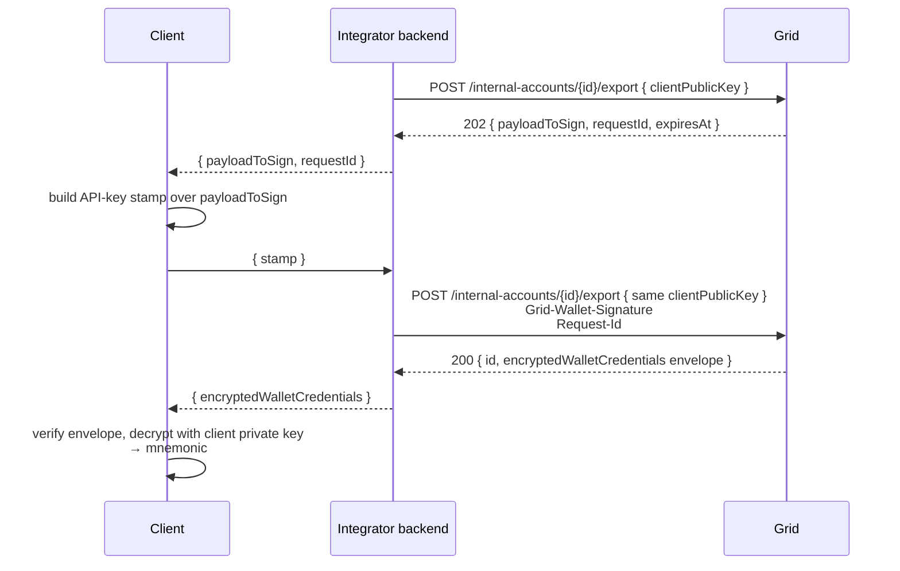

Exporting a wallet returns the wallet's mnemonic seed in an encrypted credentials envelope sealed to the client's public key. The customer verifies and decrypts that envelope on their device and can then import the wallet into any compatible self-custody client. Grid never sees the plaintext seed leaving the system.

Export uses the same <a href="authentication#the-signed-retry-pattern">signed-retry pattern</a> as credential and session revocation — the initial `POST` returns a `payloadToSign`, and the stamped retry returns the encrypted seed.

Generate a fresh P-256 client key pair specifically for the export. Send its `clientPublicKey` on both export requests, then decrypt `encryptedWalletCredentials` with the matching private key after the signed retry succeeds.



<Steps>
  <Step title="First call — receive the challenge">
    ```bash
    curl -X POST "$GRID_BASE_URL/internal-accounts/InternalAccount:019542f5-b3e7-1d02-0000-000000000002/export" \
      -u "$GRID_CLIENT_ID:$GRID_CLIENT_SECRET" \
      -H "Content-Type: application/json" \
      -d '{
        "clientPublicKey": "04f45f2a22c908b9ce09a7150e514afd24627c401c38a4afc164e1ea783adaaa31d4245acfb88c2ebd42b47628d63ecabf345484f0a9f665b63c54c897d5578be2"
      }'
    ```

    **Response (202):**

    ```json
    {
      "payloadToSign": "Y2hhbGxlbmdlLXBheWxvYWQtdG8tc2lnbg==",
      "requestId": "c3f8a614-47e2-4a19-9f5d-2b0a91d47e08",
      "expiresAt": "2026-04-19T12:10:00Z"
    }
    ```
  </Step>
  <Step title="Client builds the retry stamp">
    Build an API-key stamp over `payloadToSign` with an active session API keypair on the account. Keep the export private key on the client; Grid will use the matching `clientPublicKey` from step 1 to seal the wallet credentials.
  </Step>
  <Step title="Signed retry — receive the encrypted seed">
    ```bash
    curl -X POST "$GRID_BASE_URL/internal-accounts/InternalAccount:019542f5-b3e7-1d02-0000-000000000002/export" \
      -u "$GRID_CLIENT_ID:$GRID_CLIENT_SECRET" \
      -H "Content-Type: application/json" \
      -H "Grid-Wallet-Signature: eyJwdWJsaWNLZXkiOiIwMmExYjIuLi4iLCJzaWduYXR1cmUiOiIzMDQ1MDIyMTAwLi4uIiwic2NoZW1lIjoiUDI1Nl9FQ0RTQV9TSEEyNTYifQ" \
      -H "Request-Id: c3f8a614-47e2-4a19-9f5d-2b0a91d47e08" \
      -d '{
        "clientPublicKey": "04f45f2a22c908b9ce09a7150e514afd24627c401c38a4afc164e1ea783adaaa31d4245acfb88c2ebd42b47628d63ecabf345484f0a9f665b63c54c897d5578be2"
      }'
    ```

    **Response (200):**

    ```json
    {
      "id": "InternalAccount:019542f5-b3e7-1d02-0000-000000000002",
      "encryptedWalletCredentials": "{\"version\":\"v1.0.0\",\"data\":\"7b22656e6361707065645075626c6963223a22303433...\",\"dataSignature\":\"3045022100c9...\",\"enclaveQuorumPublic\":\"04a1b2c3...\"}"
    }
    ```
  </Step>
  <Step title="Verify and decrypt on the client">
    `encryptedWalletCredentials` is a JSON string envelope. Parse the string, verify `dataSignature` against the `data` bytes using `enclaveQuorumPublic`, then hex-decode `data` to get the HPKE payload (`encappedPublic`, `ciphertext`, and `organizationId`). Decrypt the ciphertext with the export private key that matches the `clientPublicKey` you sent on both export requests.

    In sandbox, `dataSignature` and `enclaveQuorumPublic` are empty strings. Skip attestation verification in sandbox and decrypt the envelope payload directly.

    The plaintext is a BIP-39 mnemonic (the wallet's master seed).
  </Step>
</Steps>

<Warning>
  The exported mnemonic is the master key of the self-custody wallet. After decryption the customer is the only custodian — if the mnemonic is lost, the funds are lost. Surface appropriate warnings in your UI before running an export.
</Warning>
