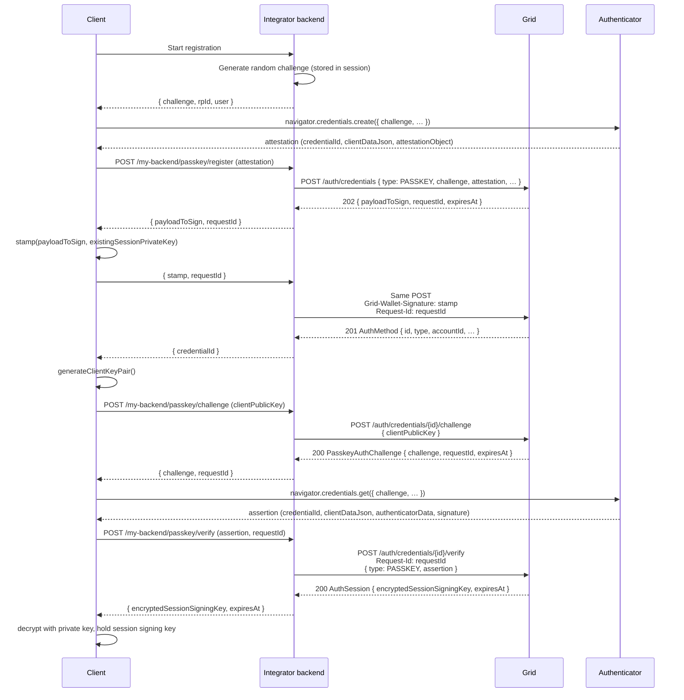
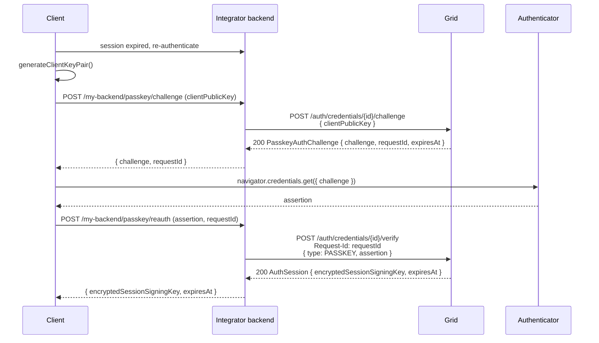
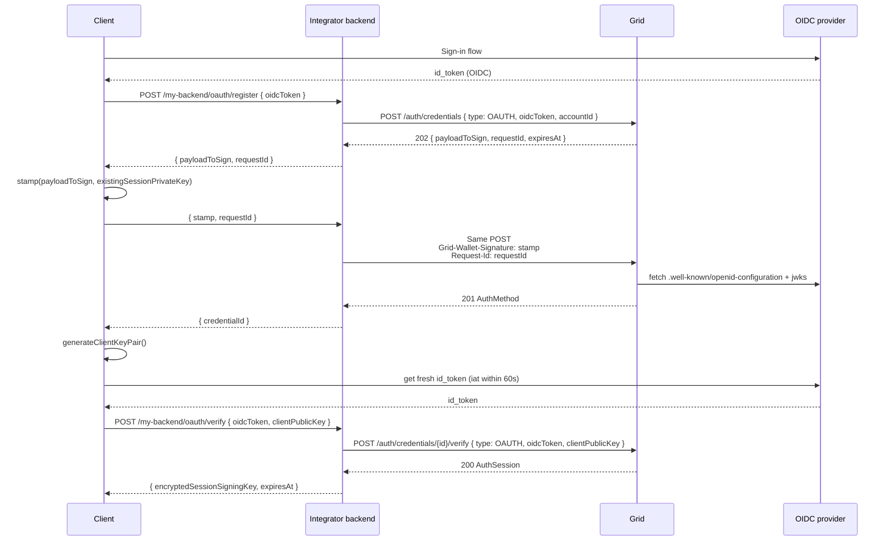
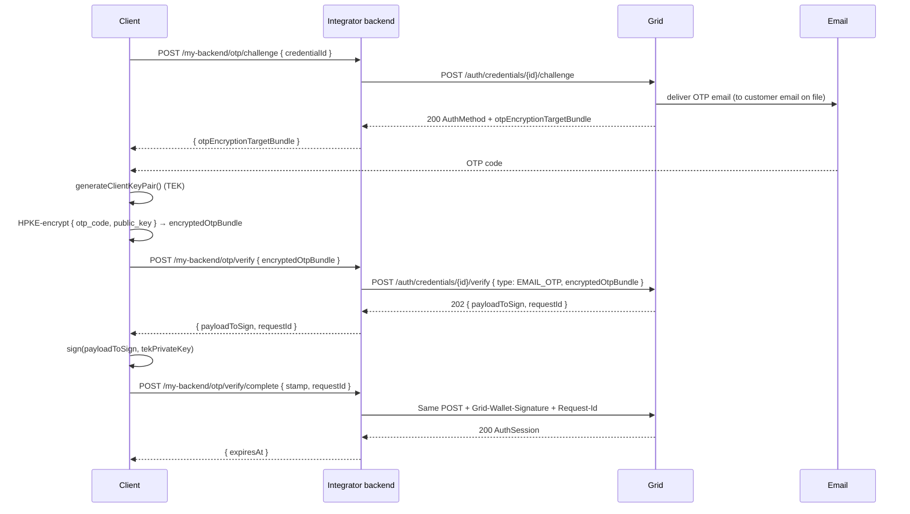
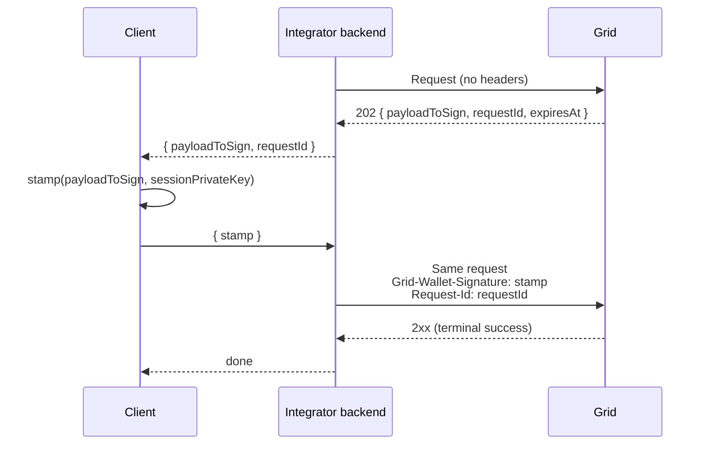

Every Global Account action beyond receiving funds must be authorized by a session signing key. Sessions are issued by verifying one of four **credential types** on the account:

| Type | When to use it |
|---|---|
| **`PASSKEY`** | Best default. Biometric, phishing-resistant, usable across the user's devices via iCloud Keychain / Google Password Manager. |
| **`OAUTH`** | Your platform already authenticates the user via OIDC (Google, Apple, your own IdP) and you want Grid to trust the same identity. |
| **`EMAIL_OTP`** | Lowest-friction option. Works on any device with email access — no biometric hardware, identity provider, or client SDK required beyond the code entry field. |
| **`SMS_OTP`** | Same flow as `EMAIL_OTP`, but delivered to the user's phone number instead of email. Useful when phone is the primary contact channel. |

A single internal account can hold one `EMAIL_OTP` credential, one `SMS_OTP` credential, and multiple distinct `PASSKEY` credentials concurrently. `OAUTH` credentials can be added for each supported provider identity.

## Registration vs. verification

Global Accounts are initialized with an `EMAIL_OTP` credential tied to the customer email on the internal account. Use that credential to mint the first session, or use an already-registered `OAUTH` or `PASSKEY` credential after you add one.

To produce a session:

- **`EMAIL_OTP`** — if you need a fresh OTP or encryption target, first call **`POST /auth/credentials/{id}/challenge`**. Generate a P-256 client key pair, HPKE-encrypt the OTP value plus the public key into `encryptedOtpBundle`, then call **`POST /auth/credentials/{id}/verify`**. Grid returns a `202` signed-retry challenge; stamp its `payloadToSign` with the same private key and retry with `Grid-Wallet-Signature` plus `Request-Id`. The signed retry returns the session; the private key you generated is the session signing key, so `EMAIL_OTP` responses do not include `encryptedSessionSigningKey`.
- **`OAUTH`** — call **`POST /auth/credentials/{id}/verify`** with a fresh OIDC token plus `clientPublicKey`. The response carries the `encryptedSessionSigningKey`.
- **`PASSKEY`** — call **`POST /auth/credentials/{id}/challenge`** with your `clientPublicKey` to receive a Grid-issued `challenge` and `requestId`, UTF-8 encode the challenge string for `navigator.credentials.get()`, then call **`POST /auth/credentials/{id}/verify`** with the resulting assertion and the `Request-Id` header. Grid bakes the `clientPublicKey` from the `/challenge` call into the session-creation payload, so it does **not** appear on the `/verify` body.

To add another credential, call **`POST /auth/credentials`** with the new credential details. Because the account already has an `EMAIL_OTP` credential, Grid returns a `202` signed-retry challenge. Stamp that `payloadToSign` with an active session signing key, then retry the same request with `Grid-Wallet-Signature` and `Request-Id`. The signed retry returns the new `AuthMethod`.

Re-authentication after a session expires skips the original `POST /auth/credentials` create call but otherwise follows the same per-type pattern. `EMAIL_OTP` re-auth needs a fresh OTP email, so call `POST /auth/credentials/{id}/challenge` first; `PASSKEY` re-auth uses the same `/challenge` (with `clientPublicKey`) → `/verify` two-step as the first authentication; `OAUTH` is the exception — since proof of control is a fresh OIDC token, there's nothing to pre-issue, so `/verify` alone suffices.

## Passkey

### Passkey registration

Passkey registration spans four parties: the **client** (browser or app), your **integrator backend**, **Grid**, and the platform authenticator (Touch ID / Face ID / Windows Hello / a security key). Your backend issues the WebAuthn registration challenge. Registering the passkey on Grid is an additional-credential signed-retry flow, authorized by an active session from an existing credential. The first authentication challenge is requested explicitly via `POST /auth/credentials/{id}/challenge` — same call shape used for every subsequent reauthentication.



The `challenge` on `POST /auth/credentials` is the one your backend issued for WebAuthn registration. The signed-retry `payloadToSign` is the registration payload that the customer's current session authorizes. The challenge used for the WebAuthn assertion comes later from `POST /auth/credentials/{id}/challenge` — Grid bakes the `clientPublicKey` you send there into the session-creation payload, sealing the resulting session signing key to the device that generated it. Because that key plumbing happens on `/challenge`, the subsequent `/verify` call carries only the assertion (plus the `Request-Id` header).

<Tip>
  Passkeys are domain-bound. Before shipping, set up your `/.well-known/apple-app-site-association` and `/.well-known/assetlinks.json` entries so the platform authenticator binds the passkey to your origin and app bundles:
  - Web: [passkeys.dev bootstrapping guide](https://passkeys.dev/docs/use-cases/bootstrapping/#opting-the-user-into-passkeys)
  - Android: [Create passkeys on Android](https://developer.android.com/identity/passkeys/create-passkeys)
  - iOS: [Supporting passkeys](https://developer.apple.com/documentation/authenticationservices/supporting-passkeys)
</Tip>

#### Client sample code

The client never talks to Grid. It talks to your integrator backend — the snippets below simulate that call with `fetch('/my-backend/...')`, which your backend then relays to Grid.

<CodeGroup>
```typescript Web (TypeScript)
// 1. Ask your backend for a registration challenge.
const startRes = await fetch("/my-backend/passkey/register/start", {
  method: "POST",
  credentials: "include",
});
const { challenge, rpId, user } = await startRes.json();

// 2. Ask the authenticator to create a passkey.
const attestation = (await navigator.credentials.create({
  publicKey: {
    challenge: base64urlToBytes(challenge),
    rp: { id: rpId, name: "Acme Wallet" },
    user: {
      id: base64urlToBytes(user.id),
      name: user.email,
      displayName: user.displayName,
    },
    pubKeyCredParams: [{ type: "public-key", alg: -7 }], // ES256
    authenticatorSelection: { residentKey: "required", userVerification: "required" },
    timeout: 60_000,
  },
})) as PublicKeyCredential;
const att = attestation.response as AuthenticatorAttestationResponse;

// 3. Send the attestation to your backend, which starts POST /auth/credentials.
const registerRes = await fetch("/my-backend/passkey/register", {
  method: "POST",
  credentials: "include",
  headers: { "Content-Type": "application/json" },
  body: JSON.stringify({
    nickname: "This device",
    credentialId: bytesToBase64url(new Uint8Array(attestation.rawId)),
    clientDataJson: bytesToBase64url(new Uint8Array(att.clientDataJSON)),
    attestationObject: bytesToBase64url(new Uint8Array(att.attestationObject)),
    transports: att.getTransports?.() ?? [],
  }),
});
const { payloadToSign, requestId: registrationRequestId } = await registerRes.json();

// 4. Stamp the registration payload with an existing session signing key, then
//    complete the signed retry. The backend retries the same Grid request with
//    Grid-Wallet-Signature and Request-Id.
const gridWalletSignature = await buildGridWalletSignature(
  existingSessionPrivateKeyBytes,
  payloadToSign,
);
const registerCompleteRes = await fetch("/my-backend/passkey/register/complete", {
  method: "POST",
  credentials: "include",
  headers: { "Content-Type": "application/json" },
  body: JSON.stringify({ requestId: registrationRequestId, gridWalletSignature }),
});
const { credentialId } = await registerCompleteRes.json();

// 5. Generate the client key pair and ask Grid for an authentication challenge
//    sealed to its public key.
const { keyPair, publicKeyHex } = await generateClientKeyPair();
const challengeRes = await fetch("/my-backend/passkey/challenge", {
  method: "POST",
  credentials: "include",
  headers: { "Content-Type": "application/json" },
  body: JSON.stringify({ credentialId, clientPublicKey: publicKeyHex }),
});
const { challenge: gridChallenge, requestId: authRequestId } = await challengeRes.json();

// 6. Run the WebAuthn assertion against the Grid-issued challenge. This
//    challenge is a lowercase hex string; UTF-8 encode it exactly as returned.
const assertion = (await navigator.credentials.get({
  publicKey: {
    challenge: new TextEncoder().encode(gridChallenge),
    rpId,
    userVerification: "required",
    allowCredentials: [{ type: "public-key", id: base64urlToBytes(credentialId) }],
  },
})) as PublicKeyCredential;
const asr = assertion.response as AuthenticatorAssertionResponse;

// 7. Send the assertion to your backend; it relays to POST /verify with Request-Id.
const verifyRes = await fetch("/my-backend/passkey/verify", {
  method: "POST",
  credentials: "include",
  headers: { "Content-Type": "application/json" },
  body: JSON.stringify({
    credentialId,
    requestId: authRequestId,
    assertion: {
      credentialId: bytesToBase64url(new Uint8Array(assertion.rawId)),
      clientDataJson: bytesToBase64url(new Uint8Array(asr.clientDataJSON)),
      authenticatorData: bytesToBase64url(new Uint8Array(asr.authenticatorData)),
      signature: bytesToBase64url(new Uint8Array(asr.signature)),
      userHandle: asr.userHandle
        ? bytesToBase64url(new Uint8Array(asr.userHandle))
        : null,
    },
  }),
});
const { encryptedSessionSigningKey, expiresAt } = await verifyRes.json();
// Decrypt and cache the session signing key — see client-keys.mdx.
```

```kotlin Android (Kotlin)
// Uses Jetpack Credential Manager.
// implementation("androidx.credentials:credentials:1.3.0")
// implementation("androidx.credentials:credentials-play-services-auth:1.3.0")
import androidx.credentials.CreatePublicKeyCredentialRequest
import androidx.credentials.CredentialManager
import androidx.credentials.GetCredentialRequest
import androidx.credentials.GetPublicKeyCredentialOption
import androidx.credentials.PublicKeyCredential

suspend fun registerPasskey(context: Context, api: MyBackendApi): EmbeddedWalletSession {
    // 1. Backend → WebAuthn registration options JSON (challenge, rp, user, ...).
    val createOptionsJson = api.passkeyRegisterStart()

    val cm = CredentialManager.create(context)

    // 2. Authenticator creates the passkey.
    val createResp = cm.createCredential(
        context = context,
        request = CreatePublicKeyCredentialRequest(createOptionsJson),
    ) as androidx.credentials.CreatePublicKeyCredentialResponse
    val attestationJson = createResp.registrationResponseJson

    // 3. Backend -> POST /auth/credentials. Returns a signed-retry challenge.
    val registerChallenge = api.passkeyRegister(attestationJson, nickname = "This device")

    // 4. Client stamps the registration payload with an existing session key.
    val gridWalletSignature = buildGridWalletSignature(
        existingSessionPrivateKeyBytes,
        registerChallenge.payloadToSign,
    )
    val registerResp = api.passkeyRegisterComplete(
        requestId = registerChallenge.requestId,
        gridWalletSignature = gridWalletSignature,
    )

    // 5. Generate client key pair, then ask Grid for an authentication challenge
    //    sealed to that public key via POST /auth/credentials/{id}/challenge.
    val clientKeys = generateClientKeyPair(alias = "embedded-wallet-${registerResp.credentialId}")
    val challengeResp = api.passkeyChallenge(
        credentialId = registerResp.credentialId,
        clientPublicKeyHex = clientKeys.publicKeyHex,
    )

    // 6. Run WebAuthn assertion against Grid-issued challenge. The returned
    //    value is a lowercase hex string; UTF-8 encode it to bytes, then put
    //    those bytes into the platform WebAuthn request format.
    val webAuthnChallenge = base64UrlEncode(
        challengeResp.challenge.toByteArray(Charsets.UTF_8),
    )
    val getOptionsJson = buildWebAuthnGetOptionsJson(
        challenge = webAuthnChallenge,
        rpId = registerResp.rpId,
        credentialId = registerResp.credentialId,
    )
    val getResp = cm.getCredential(
        context = context,
        request = GetCredentialRequest(listOf(GetPublicKeyCredentialOption(getOptionsJson))),
    ).credential as PublicKeyCredential
    val assertionJson = getResp.authenticationResponseJson

    // 7. Backend -> POST /verify with Request-Id. Returns encryptedSessionSigningKey.
    return api.passkeyVerify(
        credentialId = registerResp.credentialId,
        requestId = challengeResp.requestId,
        assertionJson = assertionJson,
    )
}
```

```swift iOS (Swift)
import AuthenticationServices

final class PasskeyCoordinator: NSObject, ASAuthorizationControllerDelegate {
    private let api: MyBackendApi
    private var continuation: CheckedContinuation<EmbeddedWalletSession, Error>?
    private var clientKeys: ClientKeyPair?
    private var pendingCredentialId: String?
    private var pendingRequestId: String?

    init(api: MyBackendApi) { self.api = api }

    func registerPasskey() async throws -> EmbeddedWalletSession {
        // 1. Backend → WebAuthn registration options.
        let options = try await api.passkeyRegisterStart()

        // 2. Authenticator creates the passkey.
        let provider = ASAuthorizationPlatformPublicKeyCredentialProvider(
            relyingPartyIdentifier: options.rpId,
        )
        let request = provider.createCredentialRegistrationRequest(
            challenge: options.challenge,
            name: options.user.name,
            userID: options.user.id,
        )
        let attestation = try await withCheckedThrowingContinuation {
            (cont: CheckedContinuation<
                ASAuthorizationPlatformPublicKeyCredentialRegistration, Error
            >) in
            let controller = ASAuthorizationController(authorizationRequests: [request])
            controller.delegate = AttestationDelegate(cont: cont)
            controller.performRequests()
        }

        // 3. Backend -> POST /auth/credentials. Returns a signed-retry challenge.
        let registerChallenge = try await api.passkeyRegister(
            credentialId: attestation.credentialID.base64URLEncoded,
            clientDataJson: attestation.rawClientDataJSON.base64URLEncoded,
            attestationObject: attestation.rawAttestationObject!.base64URLEncoded,
            nickname: "This device",
        )

        // 4. Client stamps the registration payload with an existing session key.
        let gridWalletSignature = try buildGridWalletSignature(
            sessionPrivateScalar: existingSessionPrivateScalar,
            payloadToSign: registerChallenge.payloadToSign,
        )
        let registered = try await api.passkeyRegisterComplete(
            requestId: registerChallenge.requestId,
            gridWalletSignature: gridWalletSignature,
        )

        // 5. Generate client key pair, ask Grid for an authentication challenge
        //    sealed to that public key via POST /auth/credentials/{id}/challenge.
        let keys = generateClientKeyPair()
        let challengeResp = try await api.passkeyChallenge(
            credentialId: registered.credentialId,
            clientPublicKeyHex: keys.publicKeyHex,
        )

        // 6. Run WebAuthn assertion against Grid-issued challenge. The returned
        //    value is a lowercase hex string; UTF-8 encode it as challenge bytes.
        let assertRequest = provider.createCredentialAssertionRequest(
            challenge: Data(challengeResp.challenge.utf8),
        )
        assertRequest.allowedCredentials = [
            ASAuthorizationPlatformPublicKeyCredentialDescriptor(
                credentialID: Data(base64URLEncoded: registered.credentialId)!,
            ),
        ]
        let assertion = try await withCheckedThrowingContinuation {
            (cont: CheckedContinuation<
                ASAuthorizationPlatformPublicKeyCredentialAssertion, Error
            >) in
            let controller = ASAuthorizationController(authorizationRequests: [assertRequest])
            controller.delegate = AssertionDelegate(cont: cont)
            controller.performRequests()
        }

        // 7. Backend -> POST /verify with Request-Id. Returns encryptedSessionSigningKey.
        return try await api.passkeyVerify(
            credentialId: registered.credentialId,
            requestId: challengeResp.requestId,
            clientDataJson: assertion.rawClientDataJSON.base64URLEncoded,
            authenticatorData: assertion.rawAuthenticatorData.base64URLEncoded,
            signature: assertion.signature.base64URLEncoded,
            userHandle: assertion.userID?.base64URLEncoded,
        )
    }
}
```
</CodeGroup>

#### WebAuthn → Grid parameter map

These are the fields you need to pass through on each hop.

**Registration (`/auth/credentials`):**

| Browser (`credential`) | Your backend payload | Grid request body |
|---|---|---|
| `credential.rawId` | `credentialId` | `attestation.credentialId` |
| `response.clientDataJSON` | `clientDataJson` | `attestation.clientDataJson` |
| `response.attestationObject` | `attestationObject` | `attestation.attestationObject` |
| `response.getTransports()` | `transports` | `attestation.transports` |
| *(backend session state)* | `challenge` | `challenge` *(top-level, not under `attestation`)* |
| *(backend-chosen)* | `nickname` | `nickname` |
| *(Grid account id)* | — | `accountId` |

**Authentication challenge (`/auth/credentials/{id}/challenge`):**

| Source | Your backend payload | Grid request body |
|---|---|---|
| *(client-generated)* | `clientPublicKey` | `clientPublicKey` |

**Assertion (`/auth/credentials/{id}/verify`):**

| Browser (`credential`) | Your backend payload | Grid request body |
|---|---|---|
| `credential.rawId` | `credentialId` | `assertion.credentialId` |
| `response.clientDataJSON` | `clientDataJson` | `assertion.clientDataJson` |
| `response.authenticatorData` | `authenticatorData` | `assertion.authenticatorData` |
| `response.signature` | `signature` | `assertion.signature` |
| `response.userHandle` | `userHandle` | `assertion.userHandle` *(optional)* |
| *(from `/challenge` response)* | `requestId` | `Request-Id` header |

<Note>
  The WebAuthn spec names the field `clientDataJSON`. Grid spells it `clientDataJson` (lowercase `json`) for consistency with the rest of the API. The **bytes are identical** — only the field name changes.
</Note>

### Passkey reauthentication

When a session expires the client re-verifies without recreating the credential. Reauthentication uses the same `/challenge` → `/verify` shape as the first authentication: generate a fresh client key pair, call `POST /auth/credentials/{id}/challenge` with the new `clientPublicKey`, UTF-8 encode the returned challenge string for `navigator.credentials.get()`, then call `/verify` with the assertion and the matching `Request-Id` header.



## OAuth (OIDC)

Use an OAuth credential when your platform already authenticates the user with an OpenID Connect identity provider (Google, Apple, your own IdP) and you want Grid to trust that same identity. Adding OAuth to an initialized Global Account requires an active session from an existing credential and uses the same signed-retry pattern as passkey registration.

### OAuth registration



Grid validates the OIDC token signature against the issuer's JWKS on every call and requires `iat` to be no more than **60 seconds** older than the request. Use a fresh token for each `verify` call; cached tokens will fail. The token identity (`iss`, `aud`, and `sub`) must match the OAuth credential being verified.

<Note>
  In sandbox, OAuth still uses JWT-shaped OIDC tokens. The sandbox skips real IdP signature verification, but it validates the same identity and freshness claims. For `verify`, include `nonce` equal to `sha256(clientPublicKey)`. See [Sandbox testing](/global-accounts/platform-tools/sandbox-testing#oauth-oidc-token).
</Note>

```bash
curl -X POST "$GRID_BASE_URL/auth/credentials" \
  -u "$GRID_CLIENT_ID:$GRID_CLIENT_SECRET" \
  -H "Content-Type: application/json" \
  -d '{
    "type": "OAUTH",
    "accountId": "InternalAccount:019542f5-b3e7-1d02-0000-000000000002",
    "oidcToken": "eyJhbGciOiJSUzI1NiIsImtpZCI6ImFiYzEyMyIsInR5cCI6IkpXVCJ9..."
  }'
```

**Response on the signed retry:** `201 AuthMethod` with `nickname` populated from the OIDC token's `email` claim.

### OAuth verify / reauthentication

`POST /auth/credentials/{id}/verify` is also the reauthentication path — call it with a fresh OIDC token whenever the session expires.

```bash
curl -X POST "$GRID_BASE_URL/auth/credentials/AuthMethod:019542f5-b3e7-1d02-0000-000000000001/verify" \
  -u "$GRID_CLIENT_ID:$GRID_CLIENT_SECRET" \
  -H "Content-Type: application/json" \
  -d '{
    "type": "OAUTH",
    "oidcToken": "eyJhbGciOiJSUzI1NiIsImtpZCI6ImFiYzEyMyIsInR5cCI6IkpXVCJ9...",
    "clientPublicKey": "04f45f2a22c908b9ce09a7150e514afd24627c401c38a4afc164e1ea783adaaa31d4245acfb88c2ebd42b47628d63ecabf345484f0a9f665b63c54c897d5578be2"
  }'
```

## Email OTP

The lowest-friction credential type — works on any device with email access and requires no biometric hardware, identity provider, or client-side setup beyond an input field for the code. Global Accounts are initialized with an `EMAIL_OTP` credential; call `POST /auth/credentials` for `EMAIL_OTP` only if the credential was removed and you need to add it back.

### Default Email OTP credential

Grid creates the first `EMAIL_OTP` credential when the Global Account is provisioned. The credential uses the customer email on file for the internal account. To authenticate with it, send an OTP challenge, then verify using the secure encrypted OTP flow.

The client never sends the plaintext OTP code. Instead, it HPKE-encrypts the code (together with a fresh public key) to an enclave bundle returned from the challenge. The server is a pass-through and never sees the plaintext.



```bash
curl -X POST "$GRID_BASE_URL/auth/credentials/AuthMethod:019542f5-b3e7-1d02-0000-000000000004/challenge" \
  -u "$GRID_CLIENT_ID:$GRID_CLIENT_SECRET"
```

**Response (200):**

```json
{
  "id": "AuthMethod:019542f5-b3e7-1d02-0000-000000000004",
  "accountId": "InternalAccount:019542f5-b3e7-1d02-0000-000000000002",
  "type": "EMAIL_OTP",
  "nickname": "jane@example.com",
  "otpEncryptionTargetBundle": "{\"version\":\"v1.0.0\",\"data\":\"7b22...\",\"dataSignature\":\"3045...\",\"enclaveQuorumPublic\":\"04a1...\"}",
  "createdAt": "2026-04-19T12:00:00Z",
  "updatedAt": "2026-04-19T12:00:00Z"
}
```

The client generates a fresh P-256 key pair (the TEK — Target Encryption Key), HPKE-encrypts `{otp_code, public_key}` under `otpEncryptionTargetBundle`, and submits the encrypted payload. See <a href="client-keys#encrypt-the-otp-code-email_otp-only">Encrypt the OTP code</a> for implementation details.

Then verify with the encrypted OTP bundle:

```bash
curl -X POST "$GRID_BASE_URL/auth/credentials/AuthMethod:019542f5-b3e7-1d02-0000-000000000004/verify" \
  -u "$GRID_CLIENT_ID:$GRID_CLIENT_SECRET" \
  -H "Content-Type: application/json" \
  -d '{
    "type": "EMAIL_OTP",
    "encryptedOtpBundle": "{\"encappedPublic\":\"044f631a...\",\"ciphertext\":\"1fa1023390...\"}"
  }'
```

**Response (202):**

```json
{
  "type": "EMAIL_OTP",
  "payloadToSign": "eyJhbGciOiJFUzI1NiIsImtpZCI6InR1cm5rZXkifQ...",
  "requestId": "Request:7c4a8d09-ca37-4e3e-9e0d-8c2b3e9a1f21",
  "expiresAt": "2026-04-19T12:05:00Z"
}
```

The client signs `payloadToSign` with the TEK private key (the same key whose public key was encrypted in the bundle), then retries with the stamp:

```bash
curl -X POST "$GRID_BASE_URL/auth/credentials/AuthMethod:019542f5-b3e7-1d02-0000-000000000004/verify" \
  -u "$GRID_CLIENT_ID:$GRID_CLIENT_SECRET" \
  -H "Content-Type: application/json" \
  -H "Grid-Wallet-Signature: eyJwdWJsaWNLZXkiOiIwMmExYjIuLi4iLCJzY2hlbWUiOiJTSUdOQVRVUkVfU0NIRU1FX1RLX0FQSV9QMjU2Iiwic2lnbmF0dXJlIjoiMzA0NTAyMjEwMC4uLiJ9" \
  -H "Request-Id: Request:7c4a8d09-ca37-4e3e-9e0d-8c2b3e9a1f21" \
  -d '{
    "type": "EMAIL_OTP",
    "encryptedOtpBundle": "{\"encappedPublic\":\"044f631a...\",\"ciphertext\":\"1fa1023390...\"}"
  }'
```

**Response (200):**

```json
{
  "id": "Session:019542f5-b3e7-1d02-0000-000000000003",
  "accountId": "InternalAccount:019542f5-b3e7-1d02-0000-000000000002",
  "type": "EMAIL_OTP",
  "nickname": "jane@example.com",
  "createdAt": "2026-04-19T12:00:01Z",
  "updatedAt": "2026-04-19T12:00:01Z",
  "expiresAt": "2026-04-19T12:15:01Z"
}
```

The TEK public key becomes the session API key. Unlike `OAUTH` and `PASSKEY` flows, `EMAIL_OTP` does **not** return `encryptedSessionSigningKey` — the client already holds the session signing key (the TEK private key it generated).

<Note>
  **In sandbox, the OTP code is always `000000`** — encrypt that value in the bundle. The sandbox runs real HPKE end-to-end; the only shortcut is skipping email delivery. See <a href="client-keys#encrypt-the-otp-code-email_otp-only">Client keys</a> for the encryption flow.
</Note>

### Resending an OTP

If the code expires or the email didn't arrive, re-issue the challenge with `POST /auth/credentials/{id}/challenge`. This sends a fresh OTP email and leaves the `AuthMethod` otherwise untouched.

```bash
curl -X POST "$GRID_BASE_URL/auth/credentials/AuthMethod:019542f5-b3e7-1d02-0000-000000000004/challenge" \
  -u "$GRID_CLIENT_ID:$GRID_CLIENT_SECRET"
```

<Warning>
  Challenge re-issues are rate-limited. On `429`, back off for the duration returned in the `Retry-After` header before retrying.
</Warning>

### Email OTP reauthentication

Same pattern as the first activation: call `/challenge` to send a new OTP and receive a fresh `otpEncryptionTargetBundle`, generate a new TEK key pair, build the `encryptedOtpBundle`, and complete the two-step verify flow.

### Changing the email OTP address

The `EMAIL_OTP` address comes from the customer email on file. To change it, update the customer with `PATCH /customers/{customerId}`. If the customer has tied Embedded Wallet `EMAIL_OTP` credentials, Grid returns a signed-retry challenge; stamp the returned `payloadToSign` with an active session signing key, then retry the same customer update with `Grid-Wallet-Signature` and `Request-Id`. Grid syncs the customer email and tied `EMAIL_OTP` credential email together.

## Managing credentials

Every Global Account starts with a single `EMAIL_OTP` credential — the one used in the <a href="overview#quickstart">quickstart</a>. In production, encourage customers to register a backup credential, such as a passkey or OAuth credential, so the account is recoverable if their primary device is lost. Adding, revoking, and rotating credentials after the first all go through the same **two-step signed-retry** pattern.

### List credentials

```bash
curl -X GET "$GRID_BASE_URL/auth/credentials?accountId=InternalAccount:019542f5-b3e7-1d02-0000-000000000002" \
  -u "$GRID_CLIENT_ID:$GRID_CLIENT_SECRET"
```

**Response (200):**

```json
{
  "data": [
    {
      "id": "AuthMethod:019542f5-b3e7-1d02-0000-000000000001",
      "accountId": "InternalAccount:019542f5-b3e7-1d02-0000-000000000002",
      "type": "PASSKEY",
      "credentialId": "KEbWNCc7NgaYnUyrNeFGX9_3Y-8oJ3KwzjnaiD1d1LVTxR7v3CaKfCz2Vy_g_MHSh7yJ8yL0Pxg6jo_o0hYiew",
      "nickname": "iPhone Face-ID",
      "createdAt": "2026-04-08T15:30:01Z",
      "updatedAt": "2026-04-08T15:30:01Z"
    },
    {
      "id": "AuthMethod:019542f5-b3e7-1d02-0000-000000000004",
      "accountId": "InternalAccount:019542f5-b3e7-1d02-0000-000000000002",
      "type": "EMAIL_OTP",
      "nickname": "jane@example.com",
      "createdAt": "2026-04-09T10:15:00Z",
      "updatedAt": "2026-04-09T10:15:00Z"
    }
  ]
}
```

The response is not paginated — each account holds a small, bounded number of credentials.

### The signed-retry pattern

Adding an additional credential, revoking a credential, refreshing or revoking a session, exporting a wallet, updating wallet privacy, and updating a customer email tied to `EMAIL_OTP` all share the same shape:



Key rules:

- Always stamp the `payloadToSign` **byte-for-byte as Grid returned it**. Do not re-parse, re-serialize, or modify whitespace.
- Sign with the **session private key** held on the client — never ship it back to your backend.
- The retry must reach Grid before `expiresAt` (typically 5 minutes from issue).
- The `requestId` is returned as `Request:<uuid>` and is single-use; reusing one yields `401`.

### Add an additional credential

Requires an active session on an *existing* credential on the same account. The first call uses the normal credential-create body; Grid detects the pre-existing credential and responds `202` instead of `201`. `OAUTH` and `PASSKEY` are the typical additional credential types. `EMAIL_OTP` can be added back only after the existing email OTP credential has been removed, because each account supports one.

<Steps>
  <Step title="First call — receive the challenge">
    ```bash
    curl -X POST "$GRID_BASE_URL/auth/credentials" \
      -u "$GRID_CLIENT_ID:$GRID_CLIENT_SECRET" \
      -H "Content-Type: application/json" \
      -d '{
        "type": "OAUTH",
        "accountId": "InternalAccount:019542f5-b3e7-1d02-0000-000000000002",
        "oidcToken": "eyJhbGciOiJSUzI1NiIsImtpZCI6ImFiYzEyMyIsInR5cCI6IkpXVCJ9..."
      }'
    ```

    **Response (202):**

    ```json
    {
      "type": "OAUTH",
      "payloadToSign": "{\"organizationId\":\"org_2m9F...\",\"parameters\":{\"oauthProviders\":[{\"oidcToken\":\"eyJhbGciOiJSUzI1NiIsImtpZCI6ImFiYzEyMyIsInR5cCI6IkpXVCJ9...\",\"providerName\":\"Google\"}],\"userId\":\"user_2m9F...\"},\"timestampMs\":\"1775681700000\",\"type\":\"ACTIVITY_TYPE_CREATE_OAUTH_PROVIDERS\"}",
      "requestId": "Request:7c4a8d09-ca37-4e3e-9e0d-8c2b3e9a1f21",
      "expiresAt": "2026-04-08T15:35:00Z"
    }
    ```
  </Step>
  <Step title="Client stamps the payload">
    Send `payloadToSign` to the client. The client builds a Grid wallet signature with the session signing key from the existing credential's active session — see <a href="client-keys#4-sign-a-payloadtosign">signing payloads</a>.
  </Step>
  <Step title="Signed retry — credential is created">
    Re-run the same request with the stamp and request id in headers:

    ```bash
    curl -X POST "$GRID_BASE_URL/auth/credentials" \
      -u "$GRID_CLIENT_ID:$GRID_CLIENT_SECRET" \
      -H "Content-Type: application/json" \
      -H "Grid-Wallet-Signature: eyJwdWJsaWNLZXkiOiIwMmExYjIuLi4iLCJzY2hlbWUiOiJTSUdOQVRVUkVfU0NIRU1FX1RLX0FQSV9QMjU2Iiwic2lnbmF0dXJlIjoiMzA0NTAyMjEwMC4uLiJ9" \
      -H "Request-Id: Request:7c4a8d09-ca37-4e3e-9e0d-8c2b3e9a1f21" \
      -d '{
        "type": "OAUTH",
        "accountId": "InternalAccount:019542f5-b3e7-1d02-0000-000000000002",
        "oidcToken": "eyJhbGciOiJSUzI1NiIsImtpZCI6ImFiYzEyMyIsInR5cCI6IkpXVCJ9..."
      }'
    ```

    **Response (201):** a plain `AuthMethod`.
  </Step>
  <Step title="Activate the new credential">
    Activate the new credential the same way you would activate the first credential of that type — `OAUTH` goes straight to `POST /auth/credentials/{id}/verify` with a fresh `clientPublicKey`; `EMAIL_OTP` uses the `otpEncryptionTargetBundle` from the signed-retry registration response when present, or first calls `POST /auth/credentials/{id}/challenge` if the bundle is absent; `PASSKEY` first calls `POST /auth/credentials/{id}/challenge` with the `clientPublicKey` to get a Grid-issued WebAuthn challenge, then `POST /auth/credentials/{id}/verify` with the assertion and the `Request-Id` header.
  </Step>
</Steps>

<Note>
  Only one `EMAIL_OTP` credential is allowed per internal account. Multiple distinct `PASSKEY` credentials are allowed; registering the same WebAuthn credentialId twice returns `400 PASSKEY_CREDENTIAL_ALREADY_EXISTS`.
</Note>

### Revoke a credential

A credential is revoked by signing with a session from **a different credential on the same account**. This prevents a compromised credential from revoking itself to lock the legitimate owner out. An account must keep at least one credential — if only one exists, the revoke call returns `400`.

<Steps>
  <Step title="First call — receive the challenge">
    ```bash
    curl -X DELETE "$GRID_BASE_URL/auth/credentials/AuthMethod:019542f5-b3e7-1d02-0000-000000000001" \
      -u "$GRID_CLIENT_ID:$GRID_CLIENT_SECRET"
    ```

    **Response (202):**

    ```json
    {
      "type": "PASSKEY",
      "payloadToSign": "{\"organizationId\":\"org_2m9F...\",\"parameters\":{\"authenticatorIds\":[\"authenticator_2m9F...\"],\"userId\":\"user_2m9F...\"},\"timestampMs\":\"1775681700000\",\"type\":\"ACTIVITY_TYPE_DELETE_AUTHENTICATORS\"}",
      "requestId": "Request:9f7a2c10-5e88-4fb1-bd0e-1c3a8e7b2d45",
      "expiresAt": "2026-04-08T15:35:00Z"
    }
    ```
  </Step>
  <Step title="Client stamps with a different credential's session">
    The client stamps `payloadToSign` with the session signing key of an active session on any *other* credential (not the one being revoked).
  </Step>
  <Step title="Signed retry — credential is revoked">
    ```bash
    curl -X DELETE "$GRID_BASE_URL/auth/credentials/AuthMethod:019542f5-b3e7-1d02-0000-000000000001" \
      -u "$GRID_CLIENT_ID:$GRID_CLIENT_SECRET" \
      -H "Grid-Wallet-Signature: eyJwdWJsaWNLZXkiOiIwMmExYjIuLi4iLCJzY2hlbWUiOiJTSUdOQVRVUkVfU0NIRU1FX1RLX0FQSV9QMjU2Iiwic2lnbmF0dXJlIjoiMzA0NTAyMjEwMC4uLiJ9" \
      -H "Request-Id: Request:9f7a2c10-5e88-4fb1-bd0e-1c3a8e7b2d45"
    ```

    **Response:** `204 No Content`. All active sessions issued by the revoked credential are also revoked.
  </Step>
</Steps>
