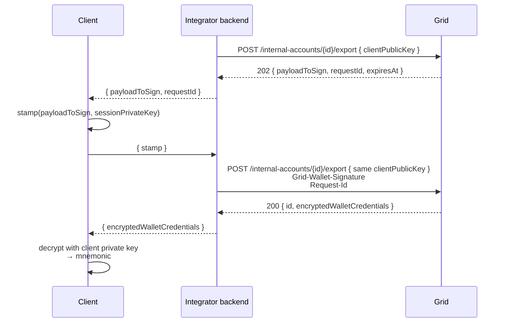

Exporting a wallet returns the wallet's mnemonic seed, encrypted to the client's public key. The customer decrypts it on their device and can then import the wallet into any compatible self-custody client. Grid never sees the plaintext seed leaving the system.

Export uses the same <a href="authentication#the-signed-retry-pattern">signed-retry pattern</a> as credential and session revocation — the initial `POST` returns a `payloadToSign`, and the signed retry returns the encrypted seed.

Generate a fresh P-256 client key pair specifically for the export. Send its `clientPublicKey` on both export requests, then decrypt `encryptedWalletCredentials` with the matching private key after the signed retry succeeds.



<Steps>
  <Step title="First call — receive the challenge">
    ```bash
    curl -X POST "$GRID_BASE_URL/internal-accounts/InternalAccount:019542f5-b3e7-1d02-0000-000000000002/export" \
      -u "$GRID_CLIENT_ID:$GRID_CLIENT_SECRET" \
      -H "Content-Type: application/json" \
      -d '{
        "clientPublicKey": "04f45f2a22c908b9ce09a7150e514afd24627c401c38a4afc164e1ea783adaaa31d4245acfb88c2ebd42b47628d63ecabf345484f0a9f665b63c54c897d5578be2"
      }'
    ```

    **Response (202):**

    ```json
    {
      "payloadToSign": "{\"organizationId\":\"org_2m9F...\",\"parameters\":{\"targetPublicKey\":\"04f45f2a22c908b9ce09a7150e514afd24627c401c38a4afc164e1ea783adaaa31d4245acfb88c2ebd42b47628d63ecabf345484f0a9f665b63c54c897d5578be2\",\"walletId\":\"wallet_2m9F...\"},\"timestampMs\":\"1775681700000\",\"type\":\"ACTIVITY_TYPE_EXPORT_WALLET\"}",
      "requestId": "Request:c3f8a614-47e2-4a19-9f5d-2b0a91d47e08",
      "expiresAt": "2026-04-19T12:10:00Z"
    }
    ```
  </Step>
  <Step title="Client stamps the payload">
    Build a Grid wallet signature over `payloadToSign` with an active session signing key on the account. Keep the export private key on the client; Grid will use the matching `clientPublicKey` from step 1 to seal the wallet credentials.
  </Step>
  <Step title="Signed retry — receive the encrypted seed">
    ```bash
    curl -X POST "$GRID_BASE_URL/internal-accounts/InternalAccount:019542f5-b3e7-1d02-0000-000000000002/export" \
      -u "$GRID_CLIENT_ID:$GRID_CLIENT_SECRET" \
      -H "Content-Type: application/json" \
      -H "Grid-Wallet-Signature: eyJwdWJsaWNLZXkiOiIwMmExYjIuLi4iLCJzY2hlbWUiOiJTSUdOQVRVUkVfU0NIRU1FX1RLX0FQSV9QMjU2Iiwic2lnbmF0dXJlIjoiMzA0NTAyMjEwMC4uLiJ9" \
      -H "Request-Id: Request:c3f8a614-47e2-4a19-9f5d-2b0a91d47e08" \
      -d '{
        "clientPublicKey": "04f45f2a22c908b9ce09a7150e514afd24627c401c38a4afc164e1ea783adaaa31d4245acfb88c2ebd42b47628d63ecabf345484f0a9f665b63c54c897d5578be2"
      }'
    ```

    **Response (200):**

    ```json
    {
      "id": "InternalAccount:019542f5-b3e7-1d02-0000-000000000002",
      "encryptedWalletCredentials": "{\"version\":\"v1.0.0\",\"data\":\"7b22656e6361707065645075626c6963223a2230346634356632612e2e2e222c2263697068657274657874223a22316661313032333339302e2e2e222c226f7267616e697a6174696f6e4964223a226f72675f326d39462e2e2e227d\",\"dataSignature\":\"3045022100...\",\"enclaveQuorumPublic\":\"04a1b2c3...\"}"
    }
    ```
  </Step>
  <Step title="Decrypt on the client">
    `encryptedWalletCredentials` is a signed wallet export envelope, not the base58check session-bundle format used by `encryptedSessionSigningKey`. Parse the envelope, verify `dataSignature` against `enclaveQuorumPublic`, decode the hex `data` JSON to get `encappedPublic` and `ciphertext`, then decrypt with the export private key that matches the `clientPublicKey` you sent on both export requests.

    The plaintext is a BIP-39 mnemonic (the wallet's master seed).
  </Step>
</Steps>

<Warning>
  The exported mnemonic is the master key of the self-custody wallet. After decryption the customer is the only custodian — if the mnemonic is lost, the funds are lost. Surface appropriate warnings in your UI before running an export.
</Warning>
