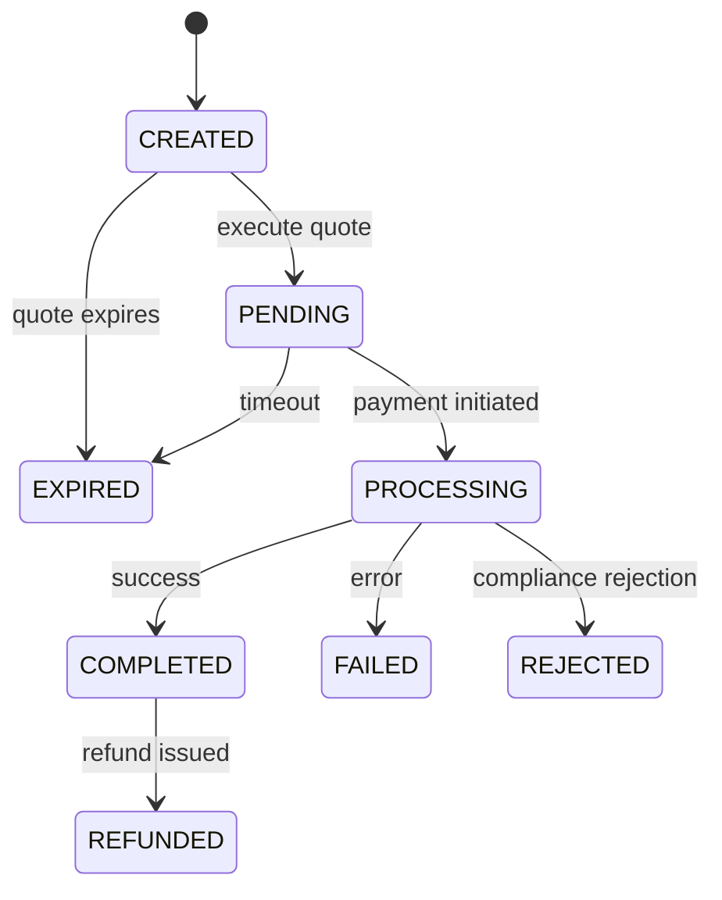
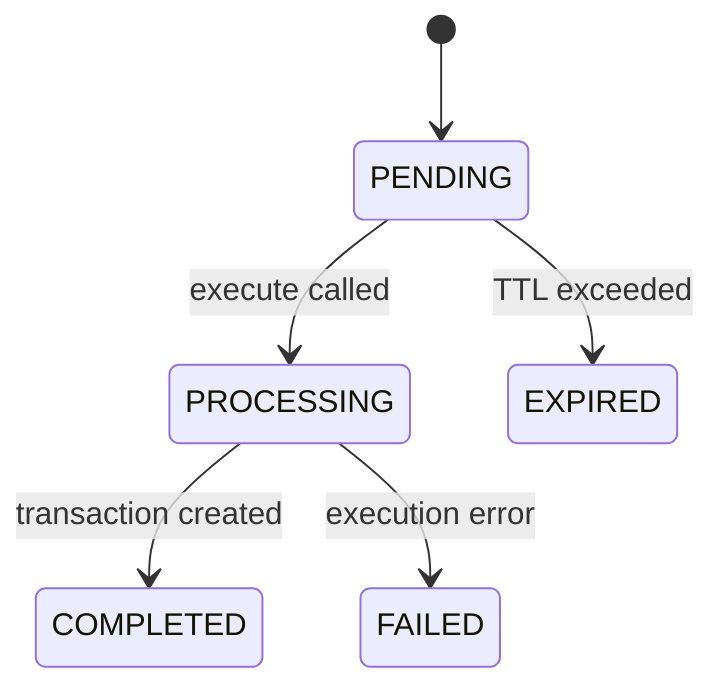

# API Design Guidelines

This readme is a continually evolving document meant to provide API design best practices for the following purposes.

1. API feels consistent
2. Preempt known bad patterns
3. Make new APIs easy to define

---

## OpenAPI schema version

This guide uses [OpenAPI schema 3.1](https://spec.openapis.org/oas/v3.1.0.html).

## Design Guidelines

- Imagine you're teaching a customer how to use our API. How might you structure the API to make it easy to explain and understand?
- Since we don't know exactly how customers will use the API, how might we make it flexible?
- Can integrators guess how your API works based on how other features work?
- When something goes wrong, can the integrator figure out why?

## Directory Structure

```
openapi/
├── openapi.yaml              # Main spec file with paths, tags, and security
├── paths/                    # Endpoint definitions organized by resource
│   ├── customers/            # Customer-related endpoints
│   ├── quotes/               # Quote-related endpoints
│   ├── transactions/         # Transaction-related endpoints
│   └── {resource}/           # Other resource endpoints
├── components/
│   └── schemas/
│       ├── common/           # Shared schemas (Address, Currency, etc.)
│       ├── customers/        # Customer schemas
│       ├── transactions/     # Transaction schemas
│       ├── errors/           # Error schemas (Error400.yaml, Error401.yaml, etc.)
│       └── {resource}/       # Other resource schemas
└── webhooks/                 # Webhook event definitions
```

### File Naming Conventions

| Pattern | Usage | Example |
|---------|-------|---------|
| `{resource}.yaml` | Collection endpoints | `customers.yaml` |
| `{resource}_{pathParam}.yaml` | Single resource endpoints | `customers_{customerId}.yaml` |
| `{resource}_{pathParam}_{action}.yaml` | Action endpoints | `quotes_{quoteId}_execute.yaml` |

---

## Versioning

We version by dates but SDKs still use semver.

### Version Format

- **API Version**: `YYYY-MM-DD` format (e.g., `2025-10-13`)
- **Server URL**: Version is included in the path: `https://api.lightspark.com/grid/2025-10-13`
- **SDK Version**: Follows semver (`1.0.0`, `1.1.0`, `2.0.0`)

### What's Considered a Breaking Change

- New required field on request
- Removing a field from response
- Changing a field name
- Changing a resource name or path
- Changing the type of a field
- Removing an enum value

When you release an SDK, Stainless will flag breaking changes.

### What's Not a Breaking Change

- Making a required field optional
- Adding a new optional field
- Adding a new enum value
- Adding a new endpoint
- Adding a new response field

### Deprecation Policy

*TBD! BUT initial thoughts* 

1. Mark deprecated endpoints with `deprecated: true` in OpenAPI spec
2. Document deprecation in changelog and SDK release notes
3. Maintain deprecated endpoints for at least 6 months
4. Communicate migration path in documentation

### Instead of a breaking change, you can

- Add new optional fields instead of modifying existing ones
- Create a new endpoint if behavior must change significantly

---

## Naming Conventions

### Resources

- Use **plural nouns** for resource names: `/customers` not `/customer`
- Exception: Use singular when there can only be one (e.g., `/config`)

### Identifiers

ID values should be prefixed with the resource type to help users identify the resource type in their system.

| Resource | ID Format | Example |
|----------|-----------|---------|
| Customer | `Customer:{uuid}` | `Customer:019542f5-b3e7-1d02-0000-000000000001` |
| Quote | `Quote:{uuid}` | `Quote:019542f5-b3e7-1d02-0000-000000000001` |
| Transaction | `Transaction:{uuid}` | `Transaction:019542f5-b3e7-1d02-0000-000000000001` |

### Field Naming

| Element | Convention | Example |
|---------|------------|---------|
| Fields | camelCase | `platformCustomerId`, `hasMore`, `nextCursor` |
| Enums | UPPER_SNAKE_CASE | `INDIVIDUAL`, `BUSINESS`, `INVALID_INPUT` |
| Query params | camelCase | `startDate`, `sortOrder`, `customerId` |
| Path params | camelCase | `customerId`, `quoteId`, `transactionId` |

Use a type hint where it makes sense eg startDate, customerId.

### Common Fields

| Name | Description |
|------|-------------|
| `id` | Unique identifier for the resource (prefixed format) |
| `createdAt` | ISO 8601 timestamp when the resource was created |
| `updatedAt` | ISO 8601 timestamp when the resource was last updated |

---

## Service Patterns

### States

Resources with lifecycle states (e.g., transactions, quotes, invitations) should document:

1. All possible states
2. Valid state transitions
3. What triggers each transition
4. Which states are terminal (no further transitions)

#### State Naming Conventions

- Use UPPER_SNAKE_CASE for state values
- Use past tense for terminal states: `COMPLETED`, `FAILED`, `CANCELLED`
- Use present continuous for in-progress states: `PENDING`, `PROCESSING`
- Use `CREATED` for initial states (not `NEW`)

#### Documenting State Machines

Include a [Mermaid State Diagram](https://mermaid.js.org/syntax/stateDiagram.html) in the schema description to visualize transitions:

```yaml
status:
  type: string
  enum:
    - CREATED
    - PENDING
    - PROCESSING
    - COMPLETED
    - FAILED
    - EXPIRED
  description: |
    Current status of the transaction.

    ```mermaid
    stateDiagram-v2
      [*] --> CREATED
      CREATED --> PENDING: Quote executed
      PENDING --> PROCESSING: Payment initiated
      PROCESSING --> COMPLETED: Payment successful
      PROCESSING --> FAILED: Payment failed
      CREATED --> EXPIRED: Quote expired
      PENDING --> EXPIRED: Timeout
    ```

    | Status | Description | Terminal |
    |--------|-------------|----------|
    | CREATED | Transaction created, awaiting execution | No |
    | PENDING | Awaiting payment or confirmation | No |
    | PROCESSING | Payment in progress | No |
    | COMPLETED | Payment successful | Yes |
    | FAILED | Payment failed | Yes |
    | EXPIRED | Quote or transaction expired | Yes |
```

#### Terminal vs Non-Terminal States

- **Terminal states**: No further transitions possible. Mark these clearly in documentation.
- **Non-terminal states**: Can transition to other states. Document what triggers each transition.

#### Example: Transaction Status



#### Example: Quote Status



### Resource Actions

When enabling an action on a resource, use `POST /{resource}/{id}/{action}`:

```
POST /quotes/{quoteId}/execute
POST /invitations/{invitationCode}/claim
POST /invitations/{invitationCode}/cancel
POST /transactions/{transactionId}/approve
POST /transactions/{transactionId}/reject
```

### Linked Resources vs Sub-Resources

Prefer flat, linked resources over deeply nested sub-resources:

```
# Preferred: Flat with query parameter
GET /external-accounts?customerId={customerId}

# Avoid: Sub-resourcing 
GET /customers/{customerId}/external-accounts
```

If an integrator wanted to get all external accounts, they would need to make one request for each customerId.

### Filtering

- Use query parameters for filtering: `?status=PENDING&customerId=Customer:123`
- Support duplicated values for multifilter: `?customerId={id_1}&customerId={id_2}`
- Use ISO 8601 for date filters: `?startDate=2025-01-01T00:00:00Z`

### Sorting

- Use `sortOrder` parameter with values `asc` or `desc`
- Default to `desc` (most recent first) for time-based resources

---

## OpenAPI Best Practices

### Discriminators and Polymorphism

OneOfs must include a discriminator:

```yaml
oneOf:
  - $ref: '#/components/schemas/IndividualCustomer'
  - $ref: '#/components/schemas/BusinessCustomer'
discriminator:
  propertyName: customerType
  mapping:
    INDIVIDUAL: '#/components/schemas/IndividualCustomer'
    BUSINESS: '#/components/schemas/BusinessCustomer'
```

#### Three-layer discriminator pattern

We use a three-layer pattern for discriminated unions:

1. **Shared enum schema** — A standalone schema defining all possible discriminator values (e.g., `CustomerType.yaml` with `enum: [INDIVIDUAL, BUSINESS]`). This generates a reusable enum class in SDKs and is used by query parameters, filters, etc.
2. **Base schema with `$ref` and discriminator** — The base schema references the shared enum and declares the discriminator mapping (e.g., `Customer.yaml` has `customerType: $ref: ./CustomerType.yaml` and a `discriminator` block).
3. **Variant schemas with single-value inline enums** — Each variant redefines the discriminator property with a single-value `enum` (e.g., `IndividualCustomerFields.yaml` has `customerType: enum: [INDIVIDUAL]`). Variants are composed with the base via `allOf`.

```
CustomerType.yaml          → enum: [INDIVIDUAL, BUSINESS]   (shared type)
Customer.yaml              → customerType: $ref CustomerType  (base, with discriminator)
IndividualCustomerFields   → customerType: enum: [INDIVIDUAL] (variant, single-value)
IndividualCustomer.yaml    → allOf: [Customer, IndividualCustomerFields]
```

#### Why variants need single-value inline enums

The inline single-value enums in variant schemas serve two purposes:

- **Python openapi-generator**: Does not reliably use the `discriminator` when deserializing JSON responses. The inline enum ensures each variant is self-describing and can be distinguished without discriminator logic.
- **Stainless Kotlin SDK**: Uses structural matching (`tryDeserialize` in sequence) rather than discriminator-based deserialization. Variants that are structurally identical (e.g., wallet types that all have `{ accountType, address }`) can only be distinguished if each has its own single-value enum that rejects other values during deserialization.

#### Why this causes `allOf` type conflicts in Stainless

When `allOf` merges a base schema (where the discriminator uses a `$ref` to the shared enum) with a variant schema (where the discriminator is an inline single-value enum), Stainless generates two different types for the same property. This causes Kotlin compilation errors like:

```
None of the following functions can be called with the arguments supplied:
  customerType(JsonField<BusinessCustomerFields.CustomerType>): Builder
  customerType(BusinessCustomerFields.CustomerType): Builder
```

#### The fix: Stainless transforms remove the property from base schemas

To resolve the conflict, Stainless transforms in `.stainless/stainless.yml` remove the discriminator property from the **base** schemas' `properties` (not from the variants). This makes the variant's inline enum the sole definition of the property in the `allOf` composition, eliminating the type conflict.

```yaml
# In .stainless/stainless.yml
openapi:
  transformations:
    - command: remove
      reason: Remove accountType $ref from base to avoid allOf type conflicts
      args:
        target:
          - "$.components.schemas.BaseExternalAccountInfo.properties"
        keys: ["accountType"]
```

**Important**: We remove from the **base**, not the variant, because:

- Removing from variants would strip the single-value enum, making structurally identical schemas (e.g., all wallet types) indistinguishable during Stainless deserialization.
- Removing from the base preserves each variant's distinct enum value for structural matching.

The original OpenAPI spec is unchanged — transforms only affect what Stainless sees during SDK generation. The Python openapi-generator and documentation continue to use the full spec with both definitions.

#### Required fields for discriminator properties

The discriminator property must be listed in `required` in the **variant** schemas (or their fields/info schemas). Since the Stainless transform removes the property from the base, the variant is the sole owner — if it's not `required` there, the generated SDK treats it as optional, causing test failures where the discriminator value is missing from roundtripped objects.

```yaml
# In the variant schema — discriminator MUST be in required
- type: object
  required:
    - accountId
    - destinationType    # ← must be here
  properties:
    destinationType:
      type: string
      enum:
        - ACCOUNT
```

### Composition

- Use `allOf` for extending base schemas

### Documentation in OpenAPI

- Add `description` to every endpoint, parameter, and schema field
- Include realistic `example` values that can be copied
- Use markdown tables in descriptions to document enum values:

```yaml
code:
  type: string
  description: |
    | Error Code | Description |
    |------------|-------------|
    | UNAUTHORIZED | Issue with API credentials |
    | INVALID_SIGNATURE | Signature header is invalid |
  enum:
    - UNAUTHORIZED
    - INVALID_SIGNATURE
```

### Validation

- Use `minimum`, `maximum` for numeric bounds
- Use `format` for standard types: `date-time`, `email`, `uri`, `uuid`
- Use `enum` for fixed value sets
- Use `pattern` for regex validation when needed

---

## HTTP Methods and Status Codes

### HTTP Methods

| Method | Usage | Success Code |
|--------|-------|--------------|
| GET | Retrieve resource(s) | 200 |
| POST | Create resource or execute action | 201 (create), 200 (action) |
| PATCH | Partial update of a resource | 200 |
| DELETE | Remove a resource | 204 |

### Success Status Codes

| Code | Usage |
|------|-------|
| 200 | Successful GET, PATCH, or action POST |
| 201 | Resource created successfully |
| 204 | Resource deleted successfully (no content) |

### Error Status Codes

Generally 4xx errors indicate an issue with the integrators request and 5xx errors indicate an issue with our services.  Our client libraries will automatically retry 5xx responses.

| Code | Meaning | When to Use |
|------|---------|-------------|
| 400 | Bad Request | Invalid input, validation errors |
| 401 | Unauthorized | Missing or invalid authentication |
| 403 | Forbidden | Valid auth but insufficient permissions |
| 404 | Not Found | Resource doesn't exist |
| 409 | Conflict | Resource already exists, state conflict |
| 412 | Precondition Failed | Conditional request failed |
| 424 | Failed Dependency | Dependent service failure |
| 500 | Internal Server Error | Unexpected server error |
| 501 | Not Implemented | Feature not yet available |

---

## Pagination

We use cursor-based pagination for all list endpoints. This pattern is compatible with Stainless SDK auto-pagination.

### Request Parameters

| Parameter | Type | Default | Description |
|-----------|------|---------|-------------|
| `limit` | integer | 20 | Maximum results to return (max: 100) |
| `cursor` | string | - | Opaque cursor from previous response |

### Response Structure

```json
{
  "data": [...],
  "hasMore": true,
  "nextCursor": "eyJpZCI6IjEyMzQ1In0=",
  "totalCount": 150
}
```

| Field | Type | Description |
|-------|------|-------------|
| `data` | array | Array of resources |
| `hasMore` | boolean | Whether more results exist |
| `nextCursor` | string | Cursor for next page (only if `hasMore: true`) |
| `totalCount` | integer | Total matching resources (excluding pagination) |

---

## Error Handling

### Error Schema Organization

Error codes across services are aggregated by HTTP status code in `components/schemas/errors/`.  As an example both `/customers` and `/transactions` may have unique 400 error codes.  All of these would be aggregated in the `Error400.yaml` definition.  Stainless then uses these to generate [unique throwable errors](https://github.com/lightsparkdev/umaaas-kotlin-sdk/blob/main/umaaas-kotlin-core/src/main/kotlin/com/lightspark/umaaas/errors/SpecificApiErrors.kt) 

| File | HTTP Status | Example Codes |
|------|-------------|---------------|
| `Error400.yaml` | 400 Bad Request | `INVALID_INPUT`, `INVALID_AMOUNT`, `MISSING_MANDATORY_USER_INFO` |
| `Error401.yaml` | 401 Unauthorized | `UNAUTHORIZED`, `INVALID_SIGNATURE` |
| `Error403.yaml` | 403 Forbidden | `FORBIDDEN`, `INSUFFICIENT_PERMISSIONS` |
| `Error404.yaml` | 404 Not Found | `NOT_FOUND`, `CUSTOMER_NOT_FOUND` |
| `Error409.yaml` | 409 Conflict | `CONFLICT`, `ALREADY_EXISTS` |
| `Error500.yaml` | 500 Internal Error | `INTERNAL_ERROR` |

### Error Response Structure

All errors follow a consistent structure:

```json
{
  "status": 400,
  "code": "INVALID_INPUT",
  "message": "The provided email address is not valid",
  "details": {
    "field": "email",
    "reason": "Invalid format"
  }
}
```

| Field | Type | Required | Description |
|-------|------|----------|-------------|
| `status` | integer | Yes | HTTP status code |
| `code` | string | Yes | Machine-readable error code (SCREAMING_SNAKE_CASE) |
| `message` | string | Yes | Human-readable error message |
| `details` | object | No | Additional context about the error |

### Error Code Guidelines

- Use SCREAMING_SNAKE_CASE for error codes
- Make codes specific and actionable (e.g., `INVALID_BANK_ACCOUNT` not just `INVALID`)
- Document all codes with descriptions in the Error schema
- Include markdown tables in the `description` field listing all codes

### Adding New Error Codes

1. Identify the appropriate HTTP status code
2. Add the new code to the corresponding `Error{StatusCode}.yaml` enum
3. Add a description in the markdown table within the `code` field description
4. Update SDK error handling if needed

---

## Stainless SDK Patterns

Our SDKs are generated by [Stainless](https://www.stainless.com/) from the OpenAPI spec.

### SDK Usage Example

```typescript
import Grid from 'grid';

const client = new Grid({
  username: process.env['GRID_USERNAME'],
  password: process.env['GRID_PASSWORD'],
});

// Auto-pagination
for await (const customer of client.customers.list()) {
  console.log(customer.id);
}

// Error handling
try {
  await client.quotes.execute('Quote:invalid');
} catch (err) {
  if (err instanceof Grid.NotFoundError) {
    console.log('Quote not found');
  }
}
```

Stainless also generates [API reference SDK examples](https://www.stainless.com/docs/guides/integrate-docs#how-stainless-generates-sdk-code-snippets) for our Mintlify documentation

### Stainless OpenAPI Transforms

Stainless transforms modify the OpenAPI spec during SDK generation without editing the source file. They are configured in `.stainless/stainless.yml` under `openapi.transformations`.

We use transforms to resolve `allOf` type conflicts caused by the [three-layer discriminator pattern](#three-layer-discriminator-pattern). See that section for the full explanation.

#### When adding a new `oneOf` with discriminator

If you add a new discriminated `oneOf` that follows the three-layer pattern (base with `$ref` + variants with inline enums composed via `allOf`), you must also add a `remove` transform in `.stainless/stainless.yml` to strip the discriminator property from the base schema:

1. Add the base schema to the appropriate `remove` transform target list (or create a new transform)
2. Ensure variant schemas have the discriminator property in both `properties` (with single-value enum) and `required`
3. Re-generate the SDK and verify tests pass

#### Available transform commands


| Command              | Use case                                                                |
| -------------------- | ----------------------------------------------------------------------- |
| `remove` with `keys` | Remove a property from a schema's `properties` object                   |
| `update`             | Replace a property definition (e.g., inline enum → `$ref`)              |
| `append`             | Add a new field (fails if it already exists — good for temporary fixes) |
| `merge`              | Add permanent metadata like `x-stainless-naming`                        |


See [Stainless transforms documentation](https://www.stainless.com/docs/guides/transforms/) for the full reference.

---

## Redocly CLI

We use Redocly CLI to bundle and lint the OpenAPI schema.

### Bundling

```bash
npx @redocly/cli bundle openapi/openapi.yaml -o openapi.yaml
```

### Useful Features

- [Hide APIs for internal use](https://redocly.com/docs/cli/guides/hide-apis)
- Lint rules configured in `.redocly.yaml`
- Ignore specific lint rules in `.redocly.lint-ignore.yaml`

